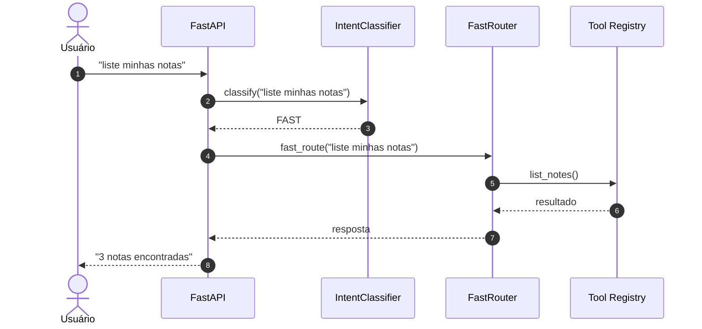
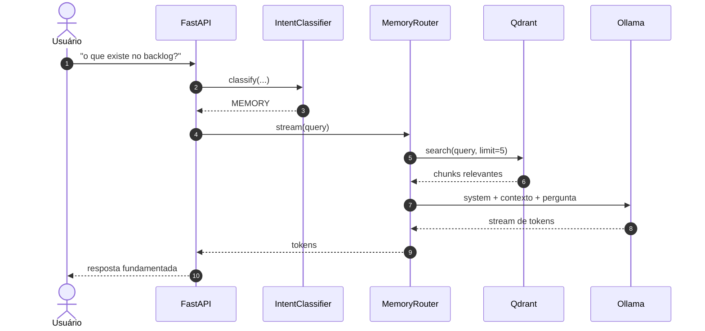
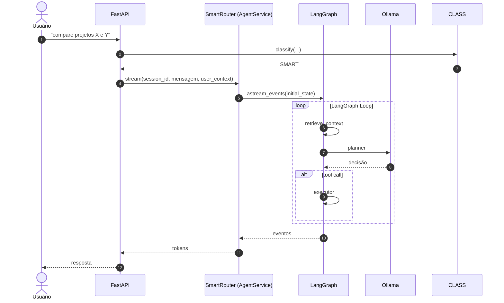
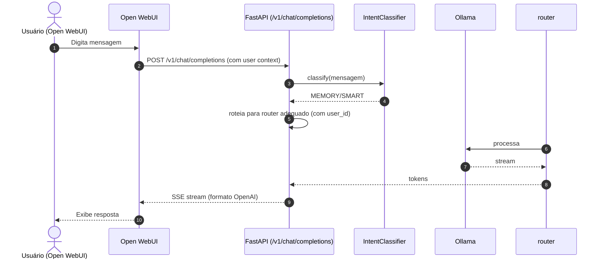

Source: Notas no ClickUp
Tags: #langgraph #agente #fluxo #fastapi #proxy #openai
Related: [[index]] [[01_estrutura_pastas]] [[sdd_obsidian_memoria]]

# Fluxo de Dados e Ciclo de Vida do Agente

Esta nota documenta os caminhos que uma mensagem percorre, incluindo o **roteamento inteligente** (FAST/MEMORY/SMART).

---

## Visão Geral do Roteamento

Toda mensagem passa pelo `IntentClassifier` antes de ser processada:

1. **FAST** → execução direta de tools (sem LLM, sem RAG, sem LangGraph)
2. **MEMORY** → RAG + LLM (sem LangGraph)
3. **SMART** → LangGraph completo (planner + executor + tools)

```
                                 ┌─────────────┐
                                 │  Mensagem    │
                                 │  + user_id   │
                                 └──────┬──────┘
                                        │
                                 ┌──────▼──────┐
                                 │   Cache     │
                                 │  (hit? retorna) │
                                 └──────┬──────┘
                                        │
                                 ┌──────▼──────────┐
                                 │ IntentClassifier │
                                 │  keyword + LLM   │
                                 └──────┬──────────┘
                                        │
                    ┌───────────────────┼───────────────────┐
                    │                   │                   │
              ┌─────▼─────┐     ┌──────▼──────┐     ┌─────▼──────┐
              │   FAST     │     │   MEMORY    │     │   SMART     │
              │ (tool sem  │     │ (RAG + LLM  │     │ (LangGraph  │
              │  LLM/RAG)  │     │  sem tools) │     │  completo)  │
              └─────┬─────┘     └──────┬──────┘     └─────┬──────┘
                    │                  │                  │
              ┌─────▼─────┐     ┌──────▼──────┐     ┌─────▼──────────┐
              │  Tool      │     │  Qdrant     │     │  AgentService  │
              │  Registry  │     │  + Ollama   │     │  (LangGraph)   │
              └───────────┘     └─────────────┘     │  + user context │
                                                     └────────────────┘
```

---

## Fluxo FAST — Execução Direta de Tools

Usado para comandos diretos que não precisam de conhecimento do vault nem raciocínio complexo.



---

## Fluxo MEMORY — RAG + LLM sem LangGraph

Usado para perguntas que precisam de contexto do Vault mas não exigem ferramentas ou raciocínio multi-passo.



---

## Fluxo SMART — LangGraph Completo

Usado para perguntas complexas que exigem planejamento, múltiplas ferramentas ou raciocínio encadeado.



---

## Fluxo Proxy OpenAI (/v1/chat/completions)

Usado pelo Open WebUI. O FastAPI atua como proxy compatível com OpenAI, com o mesmo roteamento inteligente.



---

## Relacao com outras Notas
- [[sdd_arquitetura_orquestracao]] — SDD detalhada do proxy gateway
