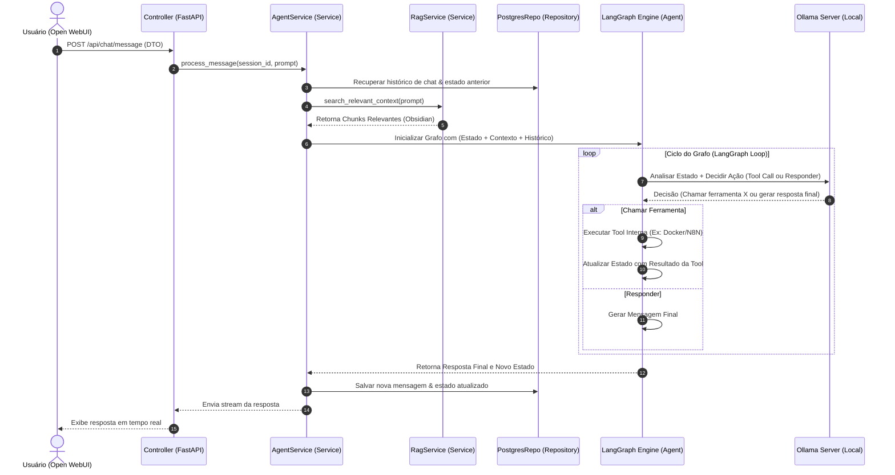
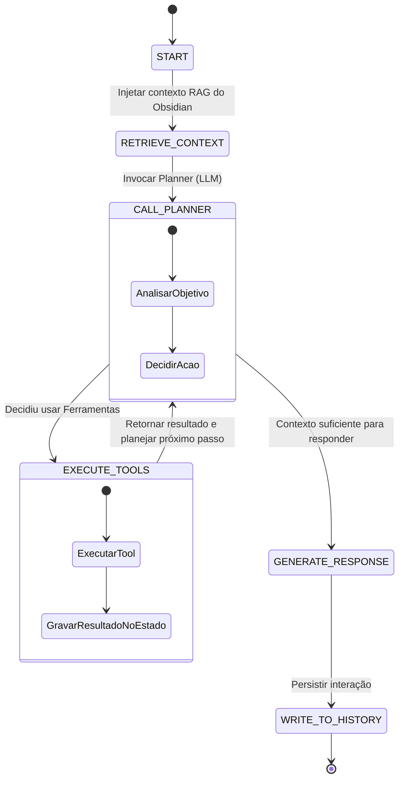

Source: Notas no ClickUp
Tags: #langgraph #agente #fluxo #fastapi
Related: [[index]] [[01_estrutura_pastas]] [[sdd_obsidian_memoria]] [[04_integracoes]]

# Fluxo de Dados e Ciclo de Vida do Agente

Esta nota documenta o caminho que uma mensagem percorre desde o envio pelo usuário (no Open WebUI) até a geração da resposta enriquecida, passando pelo LangGraph, RAG e execução de ferramentas.

---

## 🔄 Fluxo de Requisição de Chat

---

## 🧠 Ciclo de Vida do Grafo do Agente (LangGraph)

O Grafo do Agente é estruturado para tomar decisões dinâmicas baseadas em loops de feedback.

### Nós do Grafo (Nodes)

1. **`retrieve_context`**: Consulta o `VectorStoreRepository` no Qdrant para puxar notas recentes do Obsidian vinculadas ao tema da conversa.
2. **`planner`**: O LLM local processa o input do usuário juntamente com o contexto recuperado. Avalia se precisa rodar alguma ferramenta (como pesquisar arquivos locais, disparar automação no N8N, ou executar comandos docker).
3. **`execute_tools`**: Roda a ferramenta selecionada de forma isolada, coletando os retornos e armazenando de forma estruturada no `State`.
4. **`generate`**: Finaliza o raciocínio montando a resposta final em formato amigável (markdown).

---

## 🔗 Relação com outras Notas
- Para entender as ferramentas disponíveis na execução do grafo, veja [[04_integracoes]].
- Para ver os detalhes de persistência das tabelas do Postgres e Qdrant, acesse [[03_infraestrutura_docker]].
