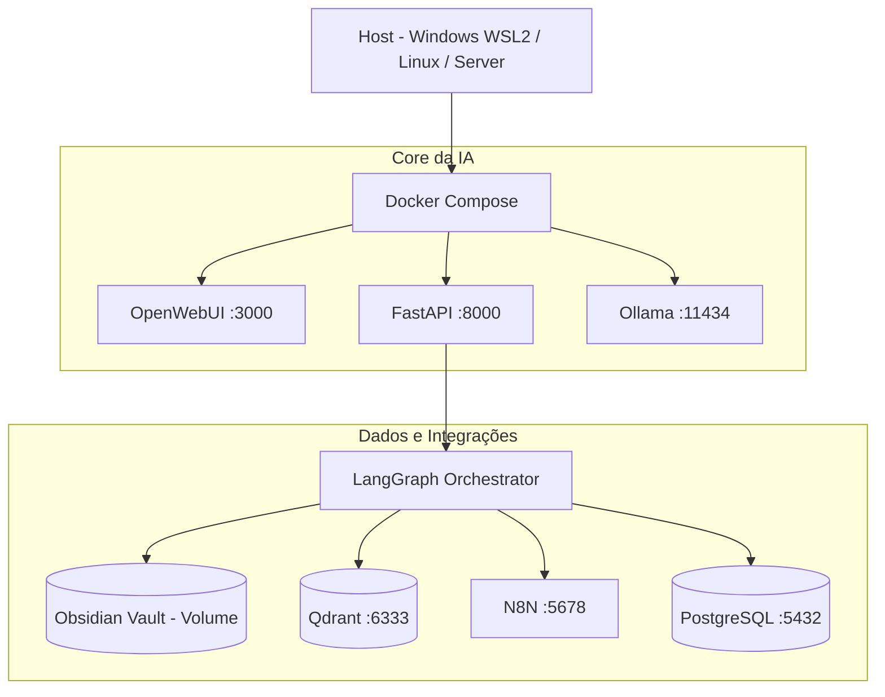

---
type: knowledge
domain: devops
status: active
---

# Infraestrutura Docker
*Docker Infrastructure & WSL2*

> Define a infraestrutura portátel do K.A.O.S rodando inteiramente em containers no ambiente WSL2 e Docker Compose.

## Parent
- [[Arquitetura Geral]]

## Children
- [[Integracoes de Servicos]]

## Related
- [[Variaveis de Ambiente]] [[Visao Geral]]

## Tags
#kaos #docker #devops #wsl2 #compose

---

## Conteudo
### Aspectos Conceituais e Requisitos
## User Story

Como desenvolvedor da plataforma de IA,
eu quero que toda a solução seja executável dentro do WSL2 utilizando Docker,
para que o mesmo ambiente funcione sem alterações no Windows, Linux local ou servidores remotos.

---

## Contexto

A plataforma de IA será utilizada em diferentes cenários:
* Desenvolvimento local no Windows
* Execução em WSL2
* Servidores Linux
* VPS em nuvem
* Homelab

O projeto não deve depender de características específicas do sistema operacional hospedeiro.
Toda a aplicação deverá ser executada através de containers Docker.

---

## Objetivo

Garantir portabilidade completa da plataforma entre ambientes locais e servidores sem necessidade de alterações de código.

---

## Escopo

### Incluído
* WSL2
* Docker Compose
* FastAPI
* Ollama
* Qdrant
* N8N
* PostgreSQL
* Open WebUI
* Obsidian Vault

### Não Incluído
* Dependências nativas do Windows
* Instalações manuais em produção
* Configurações específicas por ambiente dentro do código

---

## Princípios Arquiteturais

### PA-001
Nenhum componente deve depender diretamente do Windows.

### PA-002
Todo serviço deve ser executado em container.

### PA-003
Configurações devem ser externas ao código.

### PA-004
Todos os caminhos devem ser configurados por variáveis de ambiente.

### PA-005
O mesmo Docker Compose deve funcionar em:
* WSL2
* Ubuntu
* Debian
* AWS EC2
* Oracle Cloud
* Digital Ocean
* Proxmox

---

## Arquitetura



---

## Componentes

* **Open WebUI (Porta 3000)**: Responsável pela interface de usuário.
* **FastAPI (Porta 8000)**: Responsável pela API principal.
* **Ollama (Porta 11434)**: Responsável pela execução local dos modelos.
* **Qdrant (Porta 6333)**: Responsável pela memória vetorial.
* **PostgreSQL (Porta 5432)**: Responsável pelos metadados da plataforma.
* **N8N (Porta 5678)**: Responsável pelas integrações externas.

---

## Estratégia para Obsidian

### Requisito
O Vault não deve ficar dentro do container.

### Implementação
O Vault será montado como volume Docker.

* **Desenvolvimento**: `/mnt/c/Users/<user>/Obsidian`
* **Servidor**: `/srv/obsidian-vault`

### Configuração
```env
VAULT_PATH=/vault
```

### Benefícios
* Independência do sistema operacional
* Backup simplificado
* Migração simples

---

## Estrutura de Diretórios

### Desenvolvimento
```text
~/projects/
├── kaos-platform
├── obsidian-vault
└── backups
```

### Produção
```text
/srv/
├── kaos-platform
├── obsidian-vault
├── backups
└── logs
```

---

## Estratégia de Configuração

### Arquivos
```text
.env.local
.env.server
```

### Variáveis Obrigatórias
```env
ENVIRONMENT=local
VAULT_PATH=/vault
OLLAMA_HOST=http://ollama:11434
QDRANT_URL=http://qdrant:6333
POSTGRES_URL=postgresql://...
```

---

## Persistência

### Volumes Docker
```yaml
volumes:
  ollama_data:
  qdrant_data:
  postgres_data:
  n8n_data:
```

### Objetivo
Garantir sobrevivência dos dados após:
* Reinicialização
* Atualização
* Recriação de containers

---

## Fluxo de Execução

### Fluxo de Desenvolvimento
```text
Git Pull → Docker Compose Up → Ambiente Completo Disponível
```

### Fluxo de Produção
```text
Git Pull → Docker Compose Pull → Docker Compose Up -d → Health Check
```

---

## Requisitos do Sistema

### Requisitos Funcionais
* **RF-001**: A plataforma deve funcionar em WSL2.
* **RF-002**: A plataforma deve funcionar em Linux.
* **RF-003**: O Vault Obsidian deve ser acessível por volume Docker.
* **RF-004**: A IA deve utilizar o mesmo Vault em qualquer ambiente.
* **RF-005**: A plataforma deve ser iniciada através de Docker Compose.

### Requisitos Não Funcionais
* **RNF-001**: Nenhuma dependência direta do Windows.
* **RNF-002**: Compatibilidade com Python 3.13.
* **RNF-003**: Compatibilidade com Docker Compose v2.
* **RNF-004**: Migração entre ambientes sem alteração de código.
* **RNF-005**: Recuperação completa através de backup dos volumes.

---

## Critério de Sucesso

O mesmo repositório deve ser capaz de executar a plataforma nos seguintes ambientes sem alterações no código-fonte (utilizando apenas `git pull` e `docker compose up -d`):
* Windows + WSL2
* Ubuntu / Debian
* AWS EC2 / Oracle Cloud / DigitalOcean / Proxmox

### ConfiguraçÃo Operacional e Comandos
# Infraestrutura Docker

## Docker Compose

O arquivo `infra/docker/docker-compose.yml` orquestra os servicos de infraestrutura do K.A.O.S.

### Servicos

#### PostgreSQL (`postgres:16-alpine`)
- **Porta**: 5432
- **Usuario**: `ai-p`
- **Senha**: `ai-admin`
- **Database**: `kaos`
- **Volume**: `postgres_data`

#### Qdrant (`qdrant/qdrant:latest`)
- **Porta REST**: 6333
- **Porta gRPC**: 6334
- **Volume**: `qdrant_data`
- **Funcao**: Armazenamento de embeddings vetoriais

#### Open WebUI (`ghcr.io/open-webui/open-webui:latest`)
- **Porta**: 3000 (mapeada para 8080 do container)
- **Modo**: OpenAI (conecta ao proxy `/v1/chat/completions` do K.A.O.S)
- **Depende**: postgres

### Variaveis de Ambiente

```env
APP_ENV=development
APP_PORT=8000
LOG_LEVEL=INFO
OBSIDIAN_VAULT_PATH=C:\Obsidian
OLLAMA_BASE_URL=http://localhost:11434
OLLAMA_MODEL=qwen3:4b
QDRANT_HOST=localhost
QDRANT_PORT=6333
QDRANT_COLLECTION=obsidian_memory
```

### Comandos

```bash
# Subir todos os servicos
docker compose -f infra/docker/docker-compose.yml up -d

# Ver logs
docker compose -f infra/docker/docker-compose.yml logs -f

# Parar servicos
docker compose -f infra/docker/docker-compose.yml down

# Resetar volumes (perde dados)
docker compose -f infra/docker/docker-compose.yml down -v
```


