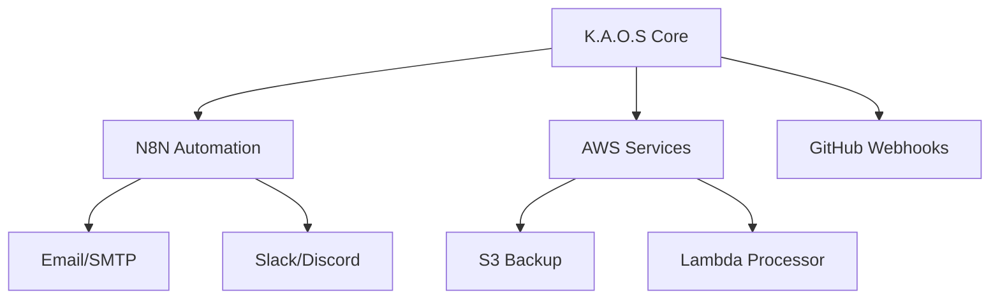

# Integracoes de Servicos
*Service Integrations (n8n, AWS, Webhooks)*

> Planejamento e documentacao das integracoes externas do K.A.O.S com servicos de automacao, cloud e comunicacao para expansao alem do ambiente local.

## Objetivo
Documentar e guiar a implementacao das integracoes planejadas entre o K.A.O.S e servicos externos como N8N, AWS, GitHub e Email para expandir as capacidades do assistente alem do ambiente local.

## Conceitos
- **N8N**: Plataforma de automacao de workflows open-source que conecta servicos via webhooks e APIs REST
- **Webhooks**: Mecanismo de notificacao HTTP para eventos assincronos de sistemas externos
- **AWS Lambda**: Funcoes serverless para processamento de eventos em nuvem com custo por execucao
- **SMTP**: Protocolo de envio de email para alertas e relatorios automatizados

## Arquitetura



## Proximas Integracoes

### N8N (Fase 9)
- Subir N8N via Docker Compose integrado ao stack existente
- Configurar webhooks para acoes externas (notificacoes, alertas)
- Automacao de workflows de processamento de dados
- Integracao com APIs de terceiros via N8N nodes nativos

### AWS (Fase 10)
- Armazenamento de backups do vault no S3
- Uso de Lambda para processamento assincrono de eventos
- CloudWatch para monitoramento de metricas e alertas

### GitHub Integration
- Webhooks para eventos de repositorio (push, PR, issues)
- Automacao de changelogs via commits analisados pelo K.A.O.S
- Sincronizacao de issues com o backlog local do vault

### Email e Notificacoes
- SMTP para alertas criticos do sistema
- Digest diario de atividades do agente
- Relatorios de indexacao vetorial do Qdrant

## Exemplos

```yaml
# docker-compose.yml - N8N Service
n8n:
  image: n8nio/n8n:latest
  ports:
    - "5678:5678"
  environment:
    - N8N_BASIC_AUTH_ACTIVE=true
    - N8N_BASIC_AUTH_USER=admin
    - N8N_BASIC_AUTH_PASSWORD=${N8N_PASSWORD}
    - WEBHOOK_URL=http://localhost:5678
  volumes:
    - n8n_data:/home/node/.n8n
  networks:
    - kaos_network
```

```python
# Exemplo de webhook handler no FastAPI
@router.post("/webhooks/n8n")
async def handle_n8n_event(payload: dict):
    event_type = payload.get("event")
    if event_type == "vault_updated":
        await trigger_reindex()
    return {"status": "processed"}
```

## Referencias
- [N8N Documentation](https://docs.n8n.io/)
- [AWS Lambda Developer Guide](https://docs.aws.amazon.com/lambda/latest/dg/)
- [GitHub Webhooks](https://docs.github.com/en/webhooks)
- [N8N Docker Setup](https://docs.n8n.io/hosting/installation/docker/)

---

## Parent
- [[Arquitetura Geral]]

## Children

## Related
- [[Infraestrutura Docker]]
- [[Variaveis de Ambiente]]
- [[Backlog do Projeto]]

## Tags
#kaos #backend #integracoes #n8n #aws #webhooks #automacao
