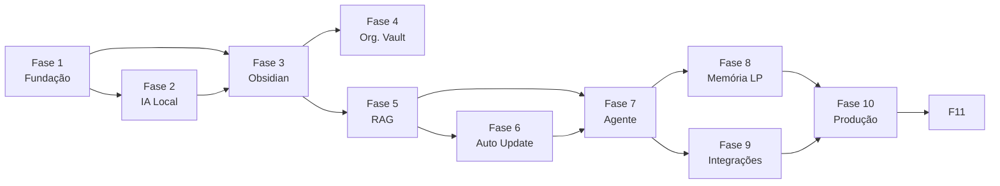

# Backlog do Projeto
*Project Backlog & Phases*

> Quadro geral de tarefas pendentes e concluidas organizadas por fase evolutiva da plataforma.

## Parent
- [[index]]

## Children
- [[Roadmap Geral]]

## Related
- [[Informacoes do Projeto]] [[Visao Geral]]

## Tags
#kaos #projetos #backlog #planning

---

## Conteudo
# Backlog — IA Pessoal Offline com Obsidian

> Rastreamento completo de todas as tarefas de desenvolvimento, organizadas por tipo e prioridade.

---

## 📊 Visão Geral de Progresso

| Fase | Nome | Itens | Status |
| :---: | :--- | :---: | :---: |
| 1 | Fundação | 7 | ✅ Completa |
| 2 | IA Local | 10 | ✅ Completa |
| 3 | Integração Obsidian | 15 | ✅ Completa |
| 4 | Organização do Vault | 12 | ✅ Completa |
| 5 | RAG | 7 | ✅ Completa |
| 6 | Atualização Automática | 5 | ✅ Completa |
| 7 | Agente Inteligente | 6 | ✅ Completa |
| 8 | Memória de Longo Prazo | 6 | ✅ Completa |
| 9 | Integrações Online | 6 | ⬜ Aguardando |
| 10 | Produção | 6 | ✅ Completa |
| 11 | Otimização e Roteamento | 8 | 🔵 Pendente |
| 12 | Production Readiness | 14 | ✅ Completa |
| 13 | Production Audit & Evolution | 7 | 🔵 Pendente |

---

---

## Legenda de Categorias

| Tag | Significado |
|:----|:------------|
| `TODO` | Tarefa pendente, priorizada |
| `DEBT` | Dívida técnica a ser paga |
| `IDEA` | Ideia não validada, sem prioridade |

---

## Mapa de Dependências entre Fases

---

---

## Próximas Tarefas Prioritárias

- [x] **Nova Release v0.1.1**: Atualização de documentação + bugfixes + monitoramento
  - [x] Completar documentação (API_KEYS, COSIGN, MONITORING, PROVIDERS, SETUP, GITHUB_ACTIONS, GRAFANA_DASHBOARDS, LOKI_QUERIES, DESKTOP_ARCHITECTURE, PROVIDER_ROUTING, VAULT_SUBMODULE, DOCUMENTATION_GOVERNANCE_SDD, TROUBLESHOOTING)
  - [x] Atualizar backlog (Fase 10 marcada como completa)
  - [x] Gerar changelog desde v0.1.0-alpha.4
  - [ ] Tag release `v0.1.1` (bloqueado pelo PAT expirado)
  - [ ] Validar desktop auto-update
- [ ] **Auditoria RAG**: Executar `/indexing/full`, validar Qdrant, logs do retriever, teste "O que existe na nota Backlog?"
- [ ] Implementar Intent Classifier (FAST/MEMORY/SMART)
- [ ] Implementar FastRouter (execução direta de tools sem LLM)
- [ ] Criar Dockerfile para o K.A.O.S (`assistant/`)

---

## Fase 1 — Fundação ✅

> Relacionado: [[Estrutura de Pastas]]

- [x] Configurar Python 3.13
- [x] Configurar ambiente virtual (`uv`)
- [x] Estruturar projeto base (`app/`, `tests/`, `docker/`, `docs/`)
- [x] Configurar Docker Compose (serviços base)
- [x] Configurar FastAPI (ponto de entrada + health check)
- [x] Configurar sistema de logs (`loguru`)
- [x] Configurar arquivos de ambiente (`.env` + `pydantic-settings`)

---

## Fase 2 — IA Local ✅

> Relacionado: [[Fase 2 - IA Local]] [[Arquitetura de Orquestracao]]

- [x] Instalar Ollama
- [x] Baixar modelo Qwen3 4B (`ollama pull qwen3:4b`)
- [x] Criar serviço de comunicação com Ollama (`app/service/llm_service.py`)
- [x] Criar endpoint de chat (`POST /api/chat/message`)
- [x] Integrar Open WebUI (configurar no Docker Compose)
- [x] Validar funcionamento 100% offline
- [x] Criar proxy OpenAI (`POST /v1/chat/completions`) em `app/api/openai.py`
- [x] Criar system prompt do K.A.O.S. em `app/config/prompts.py`
- [x] Configurar CORS no FastAPI
- [x] Aumentar timeout do LLMService (120s → 600s)

---

## Fase 3 — Integração com Obsidian

> Relacionado: [[Ferramentas do LangGraph]] [[Memoria do Obsidian]]

### ⚙️ Configuração

- [x] Identificar caminho absoluto do Vault no sistema
- [x] Configurar `OBSIDIAN_VAULT_PATH` no `.env`
- [x] Criar módulo `app/obsidian/` com `__init__.py`

### 📖 Leitura

- [x] Implementar `ObsidianService` (`app/obsidian/services/obsidian_service.py`)
- [x] Implementar `ReadNoteTool` — leitura de nota por caminho relativo
- [x] Implementar `ListNotesTool` — listagem de notas por pasta
- [x] Testar leitura de arquivos Markdown existentes no Vault

### ✏️ Escrita

- [x] Implementar `CreateNoteTool` — criação de nota com título, pasta e conteúdo
- [x] Implementar `UpdateNoteTool` — sobrescrição ou append de nota existente
- [x] Implementar `DeleteNoteTool` — remoção de nota com tratamento de erros
- [ ] Validar criação de notas geradas pelo Python no Obsidian

### 🔍 Busca

- [x] Implementar `SearchNotesTool` — busca textual por palavra-chave
- [x] Implementar busca textual com `grep` / walk do filesystem
- [x] Criar testes automatizados para todas as tools (`tests/unit/obsidian/`)

---

## Fase 4 — Organização do Vault ✅

- [x] Criar estrutura padrão de pastas no Vault (endpoint `POST /indexing/init-folders`)

Pastas a criar:

- [ ] `Projetos/` — status e escopo de projetos ativos
- [ ] `Arquitetura/` — decisões e padrões arquiteturais
- [ ] `SDD/` — System Design Documents
- [ ] `Estudos/` — resumos de aprendizado
- [ ] `IA/` — prompts, modelos e experimentos
- [ ] `Python/` — padrões, libs e tutoriais Python
- [ ] `Java/` — ecossistema Java e Spring Boot
- [ ] `AWS/` — infraestrutura e comandos AWS
- [ ] `CI-CD/` — pipelines e automações de deploy
- [ ] `Diário/` — registros diários e resumos de reuniões
- [ ] `Inbox/` — ponto de entrada para notas sem categorização

---

## Fase 5 — RAG ✅

> Relacionado: [[Busca Vetorial e RAG]]

- [x] Subir Qdrant via Docker Compose (`qdrant/qdrant`)
- [x] Configurar embeddings (modelo `BAAI/bge-m3`)
- [x] Implementar chunking de documentos (`app/rag/chunking/`)
- [x] Indexar notas do Obsidian (`app/rag/indexer/`)
- [x] Criar retriever semântico (`app/rag/retriever/`)
- [x] Testar consultas contextuais (testes em `tests/integration/rag/`)

---

## Fase 6 — Atualização Automática ✅

> Relacionado: [[Obsidian Watcher]]

- [x] Adicionar `watchdog` como dependência do projeto
- [x] Detectar evento de **criação** de arquivos `.md`
- [x] Detectar evento de **alteração** de arquivos `.md`
- [x] Detectar evento de **exclusão** de arquivos `.md`
- [x] Disparar reindexação automática no Qdrant para cada evento

---

## Fase 7 — Agente Inteligente ✅

> Relacionado: [[Fluxo de Dados]]

- [x] Instalar LangGraph (`uv add langgraph`)
- [x] Criar `Agent Orchestrator` (`app/agent/graph.py`) com nós e arestas condicionais
- [x] Criar `Tool Registry` — mapeamento de 7 ferramentas disponíveis ao agente
- [x] Integrar ferramentas do Obsidian ao Tool Registry
- [x] Implementar nó de planejamento de tarefas (`planner`)
- [x] Conectar o grafo LangGraph ao endpoint de chat (`/api/chat/message` e `/v1/chat/completions`)

---

## Fase 8 — Memória de Longo Prazo ✅

- [x] Criar memória de preferências (`Vault/IA/preferencias.md`)
- [x] Criar memória de projetos (notas em `Vault/Projetos/`)
- [x] Criar memória de arquitetura (notas em `Vault/Arquitetura/`)
- [x] Criar memória de estudos (notas em `Vault/Estudos/`)
- [x] Implementar comando **"salve esta conversa"** → `save_conversation` tool
- [x] Implementar comando **"atualize esta nota"** → busca + `UpdateNoteTool`

---

## Fase 8 — User Context & Multiusuário

> Relacionado: [[Propagacao de Contexto de Usuario]] [[Fluxo de Dados]] [[Memoria do Obsidian]]

- [ ] Criar UserContext model (`app/domain/user.py`)
- [ ] Adicionar user_id ao ChatRequest e ChatCompletionRequest
- [ ] Adicionar user_id, username, role ao AgentState
- [ ] Escopar MemoryService por usuário (`Vault/users/{user_id}/`)
- [ ] Atualizar save_conversation tool com user_id
- [ ] Propagar UserContext nos endpoints e routers
- [ ] Adicionar user_id aos logs (auditoria)
- [ ] Criar MemoryRepository protocol para futura migração PostgreSQL

---

## Fase 9 — Integrações Online

- [ ] Subir N8N via Docker Compose
- [ ] Criar integração via Webhook (N8N recebe e envia eventos ao FastAPI)
- [ ] Integrar GitHub (consulta de repositórios e código)
- [ ] Integrar Email (leitura e triagem de mensagens)
- [ ] Integrar WhatsApp (via N8N + Evolution API)
- [ ] Integrar AWS (comandos CLI e monitoramento)

---

## Fase 10 — Produção ✅

- [x] Configurar autenticação (API Key via X-API-Key header) — PR #48
- [x] Configurar backups automáticos do Vault (script `C:\Scripts\kaos-backup\backup.exe` + task agendada 23:00)
- [x] Configurar monitoramento (Prometheus + Loki + Grafana) — PR #49
- [x] Configurar CI/CD (GitHub Actions: CI, Desktop CI, Release, PR Agent)
- [x] Criar documentação técnica (`docs/vault/security/API_KEYS.md`, `docs/vault/security/COSIGN.md`, `docs/vault/monitoring/MONITORING.md`, `docs/vault/providers/PROVIDERS.md`, `docs/vault/observability/GRAFANA_DASHBOARDS.md`, `docs/vault/observability/LOKI_QUERIES.md`, `docs/vault/ci-cd/GITHUB_ACTIONS.md`, `docs/vault/architecture/DESKTOP_ARCHITECTURE.md`, `docs/vault/architecture/PROVIDER_ROUTING.md`, `docs/vault/storage/VAULT_SUBMODULE.md`, `docs/vault/governance/DOCUMENTATION_GOVERNANCE_SDD.md`, `docs/vault/troubleshooting/TROUBLESHOOTING.md`)
- [x] Criar documentação de instalação (`docs/vault/setup/SETUP.md`)

---

---

## Fase 11 — Otimização de Performance e Roteamento Inteligente

- [ ] Criar `IntentClassifier` com fast path (keyword match) + LLM fallback (Qwen3 4B)
- [ ] Criar `FastRouter` — execução direta de tools (sem LLM, sem RAG, sem LangGraph)
- [ ] Criar `MemoryRouter` — RAG + LLM sem LangGraph
- [ ] Criar `SmartRouter` — LangGraph completo (wrapping AgentService)
- [ ] Criar `ResponseCache` — cache de respostas frequentes com TTL
- [ ] Integrar roteamento em `chat.py` e `openai.py`
- [ ] Criar `ListProjectsTool` e registrar no TOOL_REGISTRY
- [ ] Adicionar suporte a modelo rápido (Qwen3 4B) vs principal (`settings.py`)

---

## Fase 12 — Production Readiness ✅ (2026-07-11)

> Epic: Preparar K.A.O.S Desktop para modo produção — eliminar dados simulados, consolidar endpoints, unificar stores, criar gates de inicialização.

### Backend
- [x] **Consolidated Dashboard Endpoint**: Criado `GET /api/system/dashboard` com `asyncio.gather` para services, runtime, metrics, costs, DLQ e alerts
- [x] **ProviderMetrics Global Tracking**: `ProviderMetrics` com `_global_entries` class-level + `global_summary()` e `global_token_rate()`
- [x] **Eliminated Simulated VRAM**: Retorna `null` (used/total) quando `nvidia-smi` ausente; frontend mostra "CPU Mode"
- [x] **Eliminated Mock CI Runs**: `integrations.py` retorna `{"runs": [], "source": "offline"}` em vez de 3 itens fabricados
- [x] **Eliminated Simulated Trigger**: `POST /api/integrations/github/trigger` retorna erro 400 em vez de sucesso simulado
- [x] **Model Installation Check**: `/api/setup/provider/active` verifica se modelo configurado está realmente instalado no Ollama

### Frontend — Store Cleanup
- [x] **Deleted Duplicate Stores**: Removidos 8 arquivos em `shared/lib/stores/` — canonical stores em `application/stores/`
- [x] **Retargeted Imports**: `documentation/index.tsx` e 7 test files atualizados para `@/application/stores`
- [x] **Deleted Dead Hook**: `application/hooks/useSystemMetrics.ts` removido (usado apenas `features/dashboard/hooks/`)

### Frontend — Mock Elimination
- [x] **Dashboard**: `fallbackAlerts`, `sysLogs` seed, `agents` seed, `SIMULATED` badge — todos removidos
- [x] **Observability**: `simulatedLogs` → `liveLogs` (SSE-only), alerts estáticos removidos, polling de `/api/notifications`
- [x] **Agents**: `DEFAULT_AGENTS` removido — sem fallback para dados fabricados
- [x] **Automation Studio**: `INITIAL_NODES`/`INITIAL_EDGES` removidos — canvas vazio quando sem workflow

### Frontend — Architecture
- [x] **Single Dashboard Call**: `system-store.ts` `fetchAll()` consolida 5 chamadas em 1 (`/api/system/dashboard`) com TTL de 3s
- [x] **Offline Gate**: `AuthGate` bloqueia páginas protegidas com overlay "Servidor K.A.O.S Offline" + botão retry
- [x] **Boot Pipeline Timing**: `use-init.ts` rastreia duração de cada estágio do bootstrap
- [x] **Error Handling**: Backend inacessível após 30s → `useSystemStore.status = "offline"` → não prossegue para "done"
- [x] **VRAM CPU Mode**: Dashboard exibe "CPU Mode" quando `vramTotal` é 0 (GPU ausente)

### Infrastructure
- [x] **Windows Terminal Fix**: `check_docker()` e `check_docker_engine()` agora usam `CREATE_NO_WINDOW` (0x08000000)
- [x] **CI Mock Audit Script**: `scripts/verify-no-mocks.ps1` — varre código por padrões de mock, falha CI se encontrados
- [x] **Contract Validation Test**: `__tests__/integration/contract-validation.test.ts` valida contrato `/api/system/dashboard`

### ADRs (Architecture Decision Records)
- Ver `docs/adr/` — decisões arquiteturais documentadas para esta fase

---

## Fase 13 — Production Readiness Audit & Platform Evolution 🔵

> Epic: Auditoria completa da plataforma K.A.O.S (Backend, Desktop, Frontend, Integrações) para qualidade de produção.

### Story 1 — Complete Backend Audit
- [ ] Auditar todos os módulos: APIs, Services, Providers, Auth, Database, RAG, LangGraph, Qdrant, Vault, Observability
- [ ] Revisar: performance, error handling, logging, configuração, segurança, débito técnico
- [ ] Identificar: código morto, lógica duplicada, serviços não utilizados, inconsistências arquiteturais

### Story 2 — Complete Frontend Audit
- [ ] Auditar todas as páginas, componentes, hooks, stores, roteamento, estado
- [ ] Revisar: loading states, responsividade, acessibilidade, UX, performance, uso de memória

### Story 3 — Integration Audit
- [ ] Auditar cada integração: Desktop ↔ Backend, Backend ↔ PostgreSQL/Qdrant/Ollama/OpenAI/Anthropic/N8N/GitHub/Docker
- [ ] Verificar: contratos, latência, retries, health checks, resiliência, comportamento offline

### Story 4 — Feature Enhancement Audit
- [ ] Revisar cada feature existente para melhorias de UX, automação, performance, usabilidade

### Story 5 — Architecture Evolution
- [ ] Avaliar: escalabilidade, modularização, plugin architecture, event-driven, caching, concurrency

### Story 6 — Technical Debt Elimination
- [ ] Classificar débito como Critical/High/Medium/Low com impacto, esforço, proposta

### Story 7 — Production Readiness Certification
- [ ] Gerar Production Readiness Report: maturity score, riscos, milestones, roadmap

---

## Divida Tecnica (DEBT)

- [x] Corrigir patch target em `tests/test_openai.py` (mira `app.api.openai_compat` ao inves de `app.api.openai`)
- [x] Substituir streaming fake do AgentService por streaming real do LangGraph
- [x] Remover bypass do LangGraph no proxy OpenAI (`/v1/chat/completions` conecta direto no Ollama)
- [ ] Adicionar `ruff` como dependencia de dev para lint
- [ ] Adicionar `.env.example` ao repositorio
- [ ] **Auditoria RAG**: Executar indexação inicial (`POST /indexing/full`), validar `points_count > 0`, adicionar logs de `retrieve_context` com query + contagem, teste manual "O que existe na nota Backlog?"
- [ ] **PAT expirado**: Push do submodule K.A.O.S-storage bloqueado — gerar novo PAT (Settings → Developer settings → PAT → escopo `repo`) e configurar no remote `docs/vault`
- [ ] **Dockerfile**: Criar `Dockerfile` para `assistant/` com volume mount do Vault (`/vault`) e `.env` configurável
- [ ] **Setup guide**: Documentar modos de execução (Windows nativo, WSL, Docker) com `.env` próprio para cada ambiente

---

## Ideias (IDEA)

- [ ] Auto-tagging de notas baseado em embeddings
- [ ] Sugestao de conexoes entre notas (grafos)
- [ ] Dashboard web para visualizar status do sistema
- [ ] Exportacao de conversas para markdown

---

*Atualizado em 2026-07-11.*

## Resumo
- Informações pendentes de validação ou auto-geração.

## Objetivo
- Informações pendentes de validação ou auto-geração.

## Responsabilidades
- Informações pendentes de validação ou auto-geração.

## Dependencias
- Informações pendentes de validação ou auto-geração.

## Fluxos
- Informações pendentes de validação ou auto-geração.

## Integracoes
- Informações pendentes de validação ou auto-geração.

## Arquivos Relacionados
- Informações pendentes de validação ou auto-geração.

## Referencias KIRL
- Informações pendentes de validação ou auto-geração.

## Status
- Informações pendentes de validação ou auto-geração.

## Ultima Atualizacao
- Informações pendentes de validação ou auto-geração.
