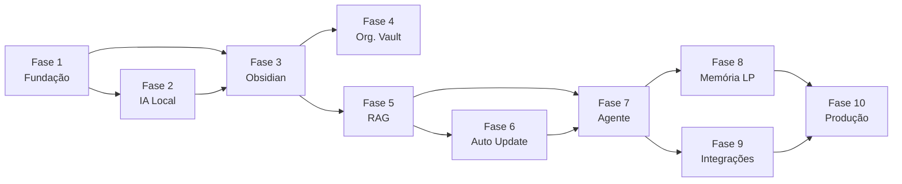

Source: Antigravity AI
Tags: #backlog #planejamento #roadmap
Related: [[index]] [[sdd_obsidian_memoria]] [[00_visao_geral]]

# 📋 Backlog — IA Pessoal Offline com Obsidian

> Rastreamento completo de todas as tarefas de desenvolvimento, organizadas por fase e prioridade. Utilizar o **Graph View** (`Ctrl+G`) para visualizar a interdependência entre fases.

---

## 📊 Visão Geral de Progresso

| Fase | Nome | Itens | Status |
| :---: | :--- | :---: | :---: |
| 1 | Fundação | 7 | 🟡 Em andamento |
| 2 | IA Local | 6 | ⬜ Aguardando |
| 3 | Integração Obsidian | 14 | 🔵 Próxima |
| 4 | Organização do Vault | 11 | ⬜ Aguardando |
| 5 | RAG | 6 | ⬜ Aguardando |
| 6 | Atualização Automática | 5 | ⬜ Aguardando |
| 7 | Agente Inteligente | 6 | ⬜ Aguardando |
| 8 | Memória de Longo Prazo | 6 | ⬜ Aguardando |
| 9 | Integrações Online | 6 | ⬜ Aguardando |
| 10 | Produção | 6 | ⬜ Aguardando |

---

## 🗺️ Mapa de Dependências entre Fases

---

## 🚀 Próximas Tarefas Prioritárias

> Estas são as ações imediatas para destravar a **Fase 3**.

- [ ] Configurar o caminho do Vault no projeto Python (`OBSIDIAN_VAULT_PATH` no `.env`)
- [ ] Criar `ObsidianService` (módulo `app/obsidian/`)
- [ ] Ler uma nota existente do Vault via Python
- [ ] Criar uma nota de teste via Python
- [ ] Implementar `SearchNotesTool` (busca textual inicial)

---

## Fase 1 — Fundação

> Objetivo: Ter a base do projeto configurada, containerizada e pronta para receber código de negócio.
> Relacionado: [[01_estrutura_pastas]]

- [ ] Configurar Python 3.13
- [ ] Configurar ambiente virtual (`uv`)
- [ ] Estruturar projeto base (`app/`, `tests/`, `docker/`, `docs/`)
- [ ] Configurar Docker Compose (serviços base)
- [ ] Configurar FastAPI (ponto de entrada + health check)
- [ ] Configurar sistema de logs (`structlog` ou `loguru`)
- [ ] Configurar arquivos de ambiente (`.env` + `pydantic-settings`)

---

## Fase 2 — IA Local

> Objetivo: Ter o LLM local rodando e respondendo via API, 100% offline.
> Relacionado: [[00_visao_geral]]

- [ ] Instalar Ollama
- [ ] Baixar modelo Qwen3 14B (`ollama pull qwen3:14b`)
- [ ] Criar serviço de comunicação com Ollama (`app/service/llm_service.py`)
- [ ] Criar endpoint de chat (`POST /api/chat/message`)
- [ ] Integrar Open WebUI (configurar no Docker Compose)
- [ ] Validar funcionamento 100% offline

---

## Fase 3 — Integração com Obsidian

> Objetivo: A IA consegue ler, criar, editar e buscar notas no Vault.
> Relacionado: [[sdd_obsidian_tools]] [[sdd_obsidian_memoria]]

### ⚙️ Configuração

- [ ] Identificar caminho absoluto do Vault no sistema
- [ ] Configurar `OBSIDIAN_VAULT_PATH` no `.env`
- [ ] Criar módulo `app/obsidian/` com `__init__.py`

### 📖 Leitura

- [ ] Implementar `ObsidianService` (`app/obsidian/services/obsidian_service.py`)
- [ ] Implementar `ReadNoteTool` — leitura de nota por caminho relativo
- [ ] Implementar `ListNotesTool` — listagem de notas por pasta
- [ ] Testar leitura de arquivos Markdown existentes no Vault

### ✏️ Escrita

- [ ] Implementar `CreateNoteTool` — criação de nota com título, pasta e conteúdo
- [ ] Implementar `UpdateNoteTool` — sobrescrição ou append de nota existente
- [ ] Implementar `DeleteNoteTool` — remoção de nota com tratamento de erros
- [ ] Validar criação de notas geradas pelo Python no Obsidian

### 🔍 Busca

- [ ] Implementar `SearchNotesTool` — busca textual por palavra-chave
- [ ] Implementar busca textual com `grep` / walk do filesystem
- [ ] Criar testes automatizados para todas as tools (`tests/unit/obsidian/`)

---

## Fase 4 — Organização do Vault

> Objetivo: Ter a estrutura de pastas do Vault padronizada para que a IA consiga categorizar conteúdo automaticamente.

- [ ] Criar estrutura padrão de pastas no Vault

Pastas a criar:

- [ ] `Projetos/` — status e escopo de projetos ativos
- [ ] `Arquitetura/` — decisões e padrões arquiteturais
- [ ] `SDD/` — System Design Documents
- [ ] `Estudos/` — resumos de aprendizado
- [ ] `IA/` — prompts, modelos e experimentos
- [ ] `Python/` — padrões, libs e tutoriais Python
- [ ] `Java/` — ecossistema Java e Spring Boot
- [ ] `AWS/` — infraestrutura e comandos AWS
- [ ] `CI-CD/` — pipelines e automações de deploy
- [ ] `Diário/` — registros diários e resumos de reuniões
- [ ] `Inbox/` — ponto de entrada para notas sem categorização

---

## Fase 5 — RAG

> Objetivo: A IA utiliza busca semântica para recuperar contexto do Vault antes de responder.
> Relacionado: [[sdd_obsidian_rag]]

- [ ] Subir Qdrant via Docker Compose (`qdrant/qdrant`)
- [ ] Configurar embeddings (modelo `BAAI/bge-m3` ou `nomic-embed-text`)
- [ ] Implementar chunking de documentos (`app/rag/chunking/`)
- [ ] Indexar todas as notas existentes do Obsidian (indexação inicial)
- [ ] Criar retriever semântico (`app/rag/retriever/`)
- [ ] Testar consultas contextuais (validar score de similaridade)

---

## Fase 6 — Atualização Automática

> Objetivo: O banco de vetores é mantido atualizado em tempo real, sem intervenção manual.
> Relacionado: [[sdd_obsidian_watcher]]

- [ ] Adicionar `watchdog` como dependência do projeto
- [ ] Detectar evento de **criação** de arquivos `.md`
- [ ] Detectar evento de **alteração** de arquivos `.md`
- [ ] Detectar evento de **exclusão** de arquivos `.md`
- [ ] Disparar reindexação automática no Qdrant para cada evento

---

## Fase 7 — Agente Inteligente

> Objetivo: Ter o LangGraph operando como o orquestrador central das decisões da IA.
> Relacionado: [[02_fluxo_dados]]

- [ ] Instalar LangGraph (`uv add langgraph`)
- [ ] Criar `Agent Orchestrator` (`app/agent/graph.py`) com nós e arestas condicionais
- [ ] Criar `Tool Registry` — mapeamento de ferramentas disponíveis ao agente
- [ ] Integrar ferramentas do Obsidian ao Tool Registry
- [ ] Implementar nó de planejamento de tarefas (`planner`)
- [ ] Implementar nó de execução de ferramentas (`executor`)

---

## Fase 8 — Memória de Longo Prazo

> Objetivo: A IA mantém conhecimento estruturado e atualizável sobre o usuário, projetos e estudos.

- [ ] Criar memória de preferências (`Vault/IA/preferencias.md`)
- [ ] Criar memória de projetos (notas em `Vault/Projetos/`)
- [ ] Criar memória de arquitetura (notas em `Vault/Arquitetura/`)
- [ ] Criar memória de estudos (notas em `Vault/Estudos/`)
- [ ] Implementar comando **"salve esta conversa"** → `CreateNoteTool` em `Vault/Diário/`
- [ ] Implementar comando **"atualize esta nota"** → busca + `UpdateNoteTool`

---

## Fase 9 — Integrações Online

> Objetivo: Conectar a IA a serviços externos sem quebrar a privacidade do núcleo offline.

- [ ] Subir N8N via Docker Compose
- [ ] Criar integração via Webhook (N8N recebe e envia eventos ao FastAPI)
- [ ] Integrar GitHub (consulta de repositórios e código)
- [ ] Integrar Email (leitura e triagem de mensagens)
- [ ] Integrar WhatsApp (via N8N + Evolution API)
- [ ] Integrar AWS (comandos CLI e monitoramento)

---

## Fase 10 — Produção

> Objetivo: Tornar o ambiente estável, seguro, monitorável e reproduzível.

- [ ] Configurar autenticação (JWT ou API Key no FastAPI)
- [ ] Configurar backups automáticos do Vault (script + cron)
- [ ] Configurar monitoramento (Prometheus + Grafana ou Loki)
- [ ] Configurar CI/CD (GitHub Actions para lint, tests e build da imagem Docker)
- [ ] Criar documentação técnica (`docs/README_tecnico.md`)
- [ ] Criar documentação de instalação (`docs/INSTALL.md`)

---

*Atualizado automaticamente — acesse [[index]] para o hub central de documentação.*
