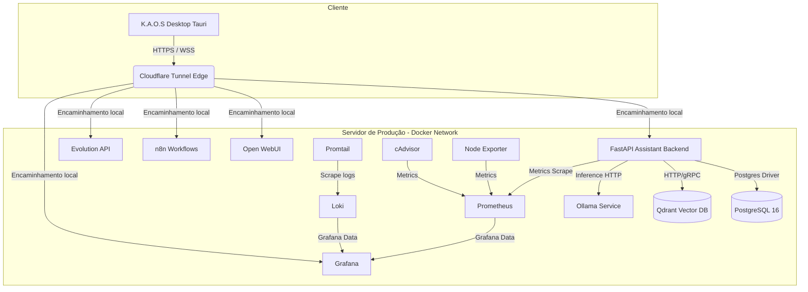

# K.A.O.S — Guia Oficial de Implantação e Produção

Este documento constitui o guia definitivo e oficial para a implantação, operação e manutenção em produção do ecossistema **K.A.O.S (Knowledge & Agentic Orchestration System)**.

---

## 1. Arquitetura

O ecossistema K.A.O.S adota uma arquitetura de microsserviços modularizada, orquestrada via Docker Compose, que interliga o backend de processamento de linguagem natural com bancos de dados, provedores de inferência, ferramentas de automação e observabilidade.



### Componentes Principais
1. **FastAPI Backend Orchestrator (`kaos-api`):** Ponto focal que coordena LangGraph, RAG (Qdrant) e agentes autônomos.
2. **PostgreSQL:** Armazenamento relacional para metadados, sessões de chats e configurações.
3. **Qdrant:** Banco de dados vetorial para armazenamento de embeddings de vaults Obsidian.
4. **Ollama:** Servidor local para execução de modelos LLM (Qwen, etc.).
5. **Open WebUI:** Interface chat web opcional alternativa para usuários finais.
6. **n8n:** Motor de workflow para automação de tarefas e conexões.
7. **Evolution API:** Interface de controle de instâncias e mensagens de WhatsApp.
8. **Stack de Observabilidade:** Prometheus, Loki, Promtail, Grafana, cAdvisor e Node Exporter para monitoramento.

---

## 2. Pré-requisitos

### Requisitos Mínimos de Servidor (Hardware)
| Recurso | Mínimo (Inferencia Nuvem) | Recomendado (Inferencia Local - GPU) |
| :--- | :--- | :--- |
| **CPU** | 4 Cores | 8 Cores (AVX2 suportado) |
| **RAM** | 16 GB | 32 GB (ou mais se rodar modelos > 14B) |
| **GPU** | N/A | NVIDIA CUDA compatível (Mínimo 16GB VRAM, ex. RTX 4080/A4000) |
| **Disco** | 50 GB SSD | 200 GB NVMe (para armazenar modelos de LLM e embeddings) |

### Requisitos de Software
* **Sistema Operacional:** Linux (Ubuntu 22.04 LTS ou posterior recomendado).
* **Docker Engine:** Versão `24.0.0` ou posterior.
* **Docker Compose:** Versão `2.20.0` ou posterior.
* **GitHub Actions Runner:** Instalado localmente (`self-hosted`) para execução do pipeline de CD.

---

## 3. Estrutura do Servidor

Para garantir a portabilidade e consistência, a seguinte estrutura de diretórios é mantida no servidor sob o caminho raiz `/opt/kaos` (ou no diretório padrão do runner):

```
/opt/kaos/
├── assistant/         # Código compilado e dependências do backend
├── config/            # Configurações dinâmicas de capabilities e ferramentas
├── docs/              # Submódulo Git de documentação contendo SDDs e Features
├── workspace/         # Dados de execução dos agentes
├── infra/
│   └── docker/
│       ├── .env.prod              # Variáveis de ambiente de produção
│       ├── docker-compose.prod.yml # Compose oficial de produção
│       ├── loki.yml               # Configuração do Loki
│       ├── prometheus.yml         # Configuração do Prometheus
│       ├── promtail.yml           # Configuração do Promtail
│       └── logs/                  # Logs locais gerados pela kaos-api
```

---

## 4. Docker

### Configurações do Docker Daemon
Para habilitar o **BuildKit** por padrão no daemon de produção (acelerando compilações locais se necessário), certifique-se de que `/etc/docker/daemon.json` contém:
```json
{
  "features": {
    "buildkit": true
  }
}
```
Reinicie o docker service após a alteração: `sudo systemctl restart docker`.

### GitHub Container Registry (GHCR)
As imagens de backend (`kaos-api`) são publicadas no repositório privado do GHCR (`ghcr.io/brian5m1th/k.a.o.s`). O servidor de produção se autentica no GHCR via comando `docker login` executado uma única vez no provisionamento ou gerenciado pelo runner com credenciais válidas.

---

## 5. Docker Compose

O arquivo [docker-compose.prod.yml](file:///c:/workspace/Freelancer/K.A.O.S/infra/docker/docker-compose.prod.yml) centraliza a orquestração dos containers. 

### Boas Práticas Adotadas
1. **Restart Rules:** Todos os contêineres críticos possuem `restart: unless-stopped`.
2. **Network Isolation:** Uso de redes customizadas dedicadas (ex: `kaos-network`) separando o tráfego da aplicação de tráfegos adicionais.
3. **Limites de Recursos:** Definição de `cpus` e `mem_limit` para conter memory leaks ou picos de processamento, principalmente em containers web e de automações.

---

## 6. Cloudflare Tunnel

O Cloudflare Zero Trust Tunnel conecta o ambiente Docker do servidor à borda da Cloudflare sem a necessidade de liberar portas de entrada (como 8000, 3000 ou 5678) no firewall físico ou IP público do servidor.

### Portabilidade e Resolução de Nomes
* **Regra Geral de Portabilidade:** Quando o agente `cloudflared` roda como container dentro do Docker Compose (Opção A), ele deve se conectar obrigatoriamente usando os **nomes dos serviços do Docker** (ex: `http://kaos-api:8000`), aproveitando a resolução de DNS interna do Docker.
* **Exceção de Execução Local:** Apenas se o `cloudflared` estiver instalado diretamente no sistema operacional do servidor (Opção B) ele utilizará a interface local (`http://192.168.100.30:1010` ou `http://localhost:1010`).

---

## 7. DNS

Todas as entradas de DNS do domínio **kaostech.com.br** devem ser delegadas e gerenciadas pelos Name Servers da Cloudflare. Ao configurar o túnel `kaos-backend-tunnel`, o próprio assistente da Cloudflare cria os registros do tipo CNAME apontando para o identificador do túnel.

---

## 8. SSL

O SSL/TLS é gerenciado e fornecido de forma nativa e automática pela Cloudflare (SSL Flexível ou Completo). 
* Todo o tráfego externo entre o K.A.O.S Desktop (ou navegadores) e a borda da Cloudflare utiliza **HTTPS criptografado** com certificados SSL válidos gerados pela Cloudflare.
* O tráfego interno (do Túnel para o servidor) é encaminhado via HTTP puro dentro de um canal tunelado seguro.

---

## 9. Deploy

O deploy é executado localmente no servidor de produção por meio de um pipeline acionado pelo GitHub Actions via **Self-Hosted Runner**:

```bash
# 1. Obter a versão mais recente das imagens
docker compose -f docker-compose.prod.yml pull

# 2. Re-iniciar a stack atualizando os containers modificados
docker compose -f docker-compose.prod.yml up -d

# 3. Remover imagens órfãs/antigas do cache para poupar espaço
docker image prune -f
```

---

## 10. Atualização

Atualizações são acionadas a partir de merges aprovados na branch `main` do GitHub. 
1. O GitHub Actions executa o pipeline de CI para verificar se os testes passaram.
2. Builda a imagem Docker com o Git SHA do commit.
3. Envia para o GHCR.
4. O `deploy.yml` é disparado no **Self-Hosted Runner**, que roda o script de deploy descrito na Seção 9.

---

## 11. Rollback

### Estratégia de Rollback
Como o Docker Compose não fornece controle nativo de versão, K.A.O.S armazena no GHCR as tags com o Git SHA correspondente (`sha-<git_sha>`).

#### Rollback Manual
Caso ocorra uma falha grave em produção:
1. Identifique o SHA do commit estável anterior no histórico de Git.
2. Edite o arquivo `.env.prod` definindo a tag da imagem para `sha-<sha_anterior>`.
3. Force a atualização:
   ```bash
   docker compose -f docker-compose.prod.yml up -d
   ```

#### Rollback Automático (Evolução Futura)
O pipeline do GitHub Actions executará o deploy e iniciará um healthcheck monitorado. Caso os serviços não respondam `healthy` dentro de 3 minutos, o pipeline reverterá o ponteiro da versão no arquivo `.env.prod` para a tag de release estável anterior e executará novamente o `docker compose up -d`.

---

## 12. Backup

A estratégia de proteção de dados exige automação de backups diários com retenção rotativa de 7 dias, exportando os arquivos para um local seguro (NAS local ou Bucket S3).

```
[PostgreSQL Database] ➔ pg_dump ➔ Compactação gzip ➔ Exportação (S3 / NAS)
[Qdrant Vetorial]     ➔ API Snapshot ➔ Download tar.gz ➔ Exportação (S3 / NAS)
[Docker Volumes]      ➔ tar czf ➔ Backup das pastas de dados ➔ Exportação (S3 / NAS)
```

As instruções detalhadas de comandos de backup encontram-se no documento [OPERATIONS_RUNBOOK.md](file:///c:/workspace/Freelancer/K.A.O.S/docs/guides/OPERATIONS_RUNBOOK.md).

---

## 13. Observabilidade

A infraestrutura de monitoramento coleta dados de saúde do host e dos containers em tempo real.

1. **Prometheus:** Coleta métricas de consumo de recursos do host via `Node Exporter` e métricas dos containers via `cAdvisor`. Além disso, consome o endpoint `/metrics` da `kaos-api`.
2. **Loki & Promtail:** O Promtail lê os arquivos JSON de logs da `kaos-api` em `/var/log/kaos-api` e envia-os para o Loki.
3. **Grafana:** Painel gráfico acessível via `https://grafana.kaostech.com.br`, integrado com Loki e Prometheus para visualização de alertas, latências de LLM, volumetria do banco vetorial e saúde física do servidor.

---

## 14. Troubleshooting

* **Erro de conexão com Qdrant/Postgres no startup:** Verifique se as dependências do Compose estão corretas. O container `kaos-api` deve aguardar o status `healthy` do banco de dados relacional.
* **Túnel Cloudflare desconectado:** Consulte o status do container `cloudflared` usando `docker compose logs cloudflared`. Verifique se o token de túnel (`CLOUDFLARE_TUNNEL_TOKEN`) está ativo no painel do Zero Trust.
* **Ollama acusando VRAM insuficiente:** Limite o concorrência de modelos reduzindo o número de workers ativos da API ou aloque memória swap do host caso esteja rodando em CPU.

---

## 15. Recuperação de Desastre

Em caso de perda total da instância do servidor:
1. Proporcione um novo servidor limpo atendendo aos pré-requisitos (Seção 2).
2. Instale o Docker, Docker Compose e configure o GitHub Self-Hosted Runner.
3. Clone o repositório principal do K.A.O.S.
4. Restaure o arquivo `.env.prod` com as chaves armazenadas no gerenciador de senhas.
5. Inicie a infraestrutura limpa: `docker compose -f docker-compose.prod.yml up -d --build`.
6. Importe os backups mais recentes do PostgreSQL e restaure os snapshots do Qdrant seguindo o [OPERATIONS_RUNBOOK.md](file:///c:/workspace/Freelancer/K.A.O.S/docs/guides/OPERATIONS_RUNBOOK.md).
7. Force a reindexação do Vault de Obsidian local via painel ou CLI.

---

## 16. Segurança

### Matriz de Segurança do Cloudflare Access
Para proteger painéis administrativos expondo apenas a API pública para uso do K.A.O.S Desktop, as seguintes políticas de segurança são aplicadas:

| Subdomínio / URL | Exposto na Internet | Cloudflare Access (OTP + 2FA) | Autenticação do App |
| :--- | :---: | :---: | :---: |
| `api.kaostech.com.br` | ✅ Sim | ❌ Não | Requer X-API-Key / JWT |
| `chat.kaostech.com.br` | ❌ Não | ✅ Sim | Requer Login do Usuário |
| `n8n.kaostech.com.br` | ❌ Não | ✅ Sim | Autenticação n8n interna |
| `whatsapp.kaostech.com.br` | ❌ Não | ✅ Sim | API Token Evolution |
| `grafana.kaostech.com.br` | ❌ Não | ✅ Sim | Login Administrador |
| `prometheus.kaostech.com.br`| ❌ Não | ✅ Sim | N/A (Apenas acesso Access) |
| `qdrant.kaostech.com.br` | ❌ Não | ✅ Sim | API Key Qdrant interna |

### Variáveis de Ambiente Seguras
* Variáveis como `POSTGRES_PASSWORD`, `API_KEY`, `HF_TOKEN`, `CLOUDFLARE_TUNNEL_TOKEN` e chaves de APIs adicionais **nunca devem ser adicionadas ao controle de versão Git**. Elas devem constar apenas no arquivo local `.env.prod` protegido com permissões restritas de leitura (`chmod 600 .env.prod`).

---

## 17. Escalabilidade

1. **Escalonamento Horizontal da API:** O serviço `kaos-api` é stateless e pode ter instâncias escaladas (`docker compose up -d --scale kaos-api=3`) caso seja colocado um balanceador de carga interno na rede Docker (como Traefik ou Nginx Helper).
2. **Connection Pooling:** O backend FastAPI gerencia pool de conexões assíncronas com o PostgreSQL para mitigar gargalos sob alta concorrência de requisições de agentes paralelos.
3. **Hardware Acceleration:** O Ollama em produção deve idealmente mapear a GPU do servidor utilizando o container runtime da NVIDIA (`nvidia-container-toolkit`) para evitar tempos altos de processamento (Time-To-First-Token).
