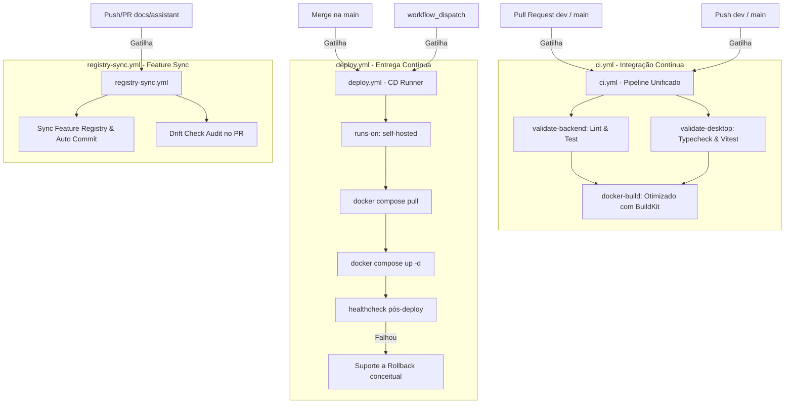

# Auditoria de Workflows e Plano de Refatoração — K.A.O.S

Este documento apresenta a auditoria técnica da infraestrutura de CI/CD do K.A.O.S, demonstrando as redundâncias identificadas, analisando os gatilhos, e propondo o plano de consolidação e migração seguro.

---

## 1. Auditoria e Diagnóstico Técnico

### Respostas Técnicas às Perguntas de Duplicação

* **Por que existem dois pipelines de CI?**
  Originalmente, o projeto separou o backend (`ci.yml` focado no `assistant`) do frontend desktop (`desktop-ci.yml` focado no `desktop`). Isso foi feito para isolar os gatilhos com base nos caminhos de arquivos modificados (`paths`). No entanto, isso gerou execuções desconectadas e dificultou o acompanhamento global da integridade do projeto.
* **Eles executam tarefas iguais? Existe duplicação?**
  Eles não duplicam tarefas de compilação em si (um compila Rust/Node e outro configura Python/uv), mas **duplicam configurações de infraestrutura (checkout, setup de ações e carregamento de submódulos)**. Além disso, as validações de documentação (`drift-check.yml` e `registry-sync.yml`) possuem uma **sobreposição direta de 100% de objetivos e lógica**, executando o script de drift em paralelo sobre os mesmos arquivos.
* **Existem testes repetidos ou lints duplicados?**
  Não há testes repetidos, mas o lint do backend e do frontend rodavam de forma desconectada. Consolidando tudo em um pipeline principal estruturado, garantimos que a aprovação final de um PR dependa do sucesso de ambos em um único painel.
* **Existem caches independentes?**
  Sim. Os caches de dependências do Python (`uv`), Node.js (`npm`) e Rust (`cargo`) estavam espalhados por múltiplos arquivos yaml, dificultando o compartilhamento e aumentando as chances de invalidação desnecessária do cache.
* **Existe upload duplicado de artefatos?**
  Não. Os artefatos gerados pelo Tauri/Vite no `desktop-ci.yml` eram focados apenas em builds de depuração para Linux, enquanto o `release.yml` produzia os artefatos finais multi-plataforma.

---

## 2. Matriz de Análise dos Workflows Atuais

A tabela abaixo sumariza todos os workflows existentes no diretório `.github/workflows`:

| Workflow | Objetivo | Jobs Principais | Sobreposição / Redundância | Pode ser removido/consolidado? |
| :--- | :--- | :--- | :--- | :--- |
| `ci.yml` | Validação do Backend | `lint`, `test`, `docker` (build, healthcheck, sign) | Configurações de checkout e paths repetidos. | **Consolidar** (Adicionar jobs paralelos do frontend/desktop). |
| `desktop-ci.yml` | Validação do Tauri Desktop | `build` (Node setup, Rust cache, Vitest, build Tauri Linux) | Isola validações do desktop desnecessariamente. | **Sim** (Jobs migrados para o `ci.yml` consolidado). |
| `drift-check.yml` | Verificar drift do Obsidian | `drift-check` (Python uv run audit) | **Totalmente redundante** com o job `drift-check` do `registry-sync.yml`. | **Sim** (Excluir sem perda de lógica). |
| `registry-sync.yml` | Atualizar Feature Index | `sync-registry` (gera JSON e faz push), `drift-check` (audita PRs) | Nenhuma. Essencial para manter o Obsidian sincronizado. | **Manter** (Com pequenos ajustes de paths). |
| `release.yml` | Compilar lançamentos oficiais | `build` (Windows, macOS, Linux), `publish` (cria GitHub release) | Compilação de Linux sobrepõe com build de teste do desktop-ci. | **Manter** (Utilizado apenas em tags `v*`). |
| `auto-release.yml` | Semantic Release automático | `release` (Semantic release de commits da main) | Nenhuma. É o gatilho que automatiza a release do repositório. | **Manter**. |
| `auto-update.yml` | Cron semanal de upstream | `check-update`, `notify` | Nenhuma. | **Manter**. |
| `setup-signing-key.yml` | Gerar chave privada Tauri | `generate` (Gera par de chaves e salva) | Nenhuma. Execução manual sob demanda. | **Manter**. |

---

## 3. Diagrama Mermaid da Arquitetura Proposta

O fluxo lógico unificado e consolidado organiza a execução de validações de forma limpa e paralela:

---

## 4. Plano de Refatoração e Migração

### Arquitetura "Antes"
* 8 arquivos YAML executando de forma dispersa.
* Validação de PRs e deploy no mesmo pipeline (`ci.yml`), gerando acionamentos desnecessários e dependência de chaves de infra expostas.
* Drift check duplo (`drift-check.yml` e `registry-sync.yml`).
* Builds do Desktop rodando independentemente do estado do backend.

### Arquitetura "Depois"
* 7 arquivos YAML estruturados.
* Separação clara de responsabilidades:
  * **Validação (CI):** [ci.yml](file:///.github/workflows/ci.yml) unifica validação de backend, frontend e build de teste do docker.
  * **Implantação (CD):** [deploy.yml](file:///.github/workflows/deploy.yml) atua localmente no servidor de produção via self-hosted runner.
* Remoção completa de redundâncias (exclusão de `drift-check.yml` e `desktop-ci.yml`).

### Riscos e Mitigação
1. **Risco:** Perda de lints ou testes na migração do `desktop-ci.yml` para o `ci.yml`.
   * *Mitigação:* Copiar integralmente as etapas de setup de Node, Rust toolchain, caches (Vite, Cargo, Npm) e testes para o novo job `validate-desktop`.
2. **Risco:** O deploy falhar no servidor por falta de permissões do Docker sob o runner local.
   * *Mitigação:* O runbook documentará a necessidade de adicionar o usuário do runner ao grupo `docker` (`sudo usermod -aG docker $USER`).

### Plano de Migração Passo a Passo
1. Criar o novo workflow de deploy: `deploy.yml`.
2. Migrar os jobs do desktop para dentro de `ci.yml`, configurando cache unificado e otimizações de build do docker com BuildKit/buildx.
3. Validar sintaticamente os novos arquivos YAML.
4. Excluir com segurança os arquivos redundantes `desktop-ci.yml` e `drift-check.yml`.
5. Fazer commit e push das alterações para a branch `dev` e testar a execução no GitHub Actions.
