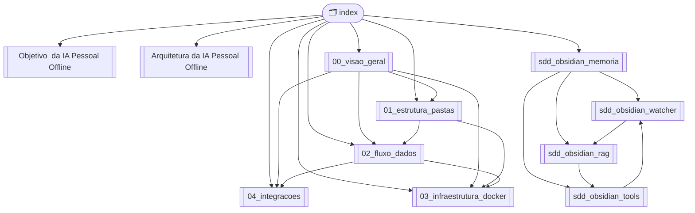

Source: Antigravity AI
Tags: #ia-pessoal #arquitetura #index
Related: [[00_visao_geral]] [[Arquitetura da IA Pessoal Offline]]

# 🤖 Assistente de IA Pessoal Offline — Índice Central

> Hub de navegação do vault. Todos os nós do Graph View passam por aqui.

---

## 🎯 Ponto de Partida

- [[Objetivo  da IA Pessoal Offline|Objetivo do Projeto]]
- [[Arquitetura da IA Pessoal Offline|Visão da Arquitetura (alto nível)]]
- [[00_visao_geral|Visão Geral Técnica (Stack e Mapa)]]

---

## 📐 Documentação Arquitetural

| Nota | Conteúdo |
| :--- | :--- |
| [[00_visao_geral\|00 — Visão Geral]] | Stack tecnológica e mapa da documentação |
| [[01_estrutura_pastas\|01 — Estrutura de Pastas]] | Camadas do projeto (Spring Boot Style) |
| [[02_fluxo_dados\|02 — Fluxo de Dados]] | Ciclo de vida da requisição e grafo LangGraph |
| [[03_infraestrutura_docker\|03 — Infraestrutura Docker]] | Docker Compose, serviços e variáveis de ambiente |
| [[04_integracoes\|04 — Integrações Obsidian & N8N]] | Webhooks, automações e sincronização |

---

## 🧠 SDDs — System Design Documents

| Nota | Componente |
| :--- | :--- |
| [[sdd_obsidian_memoria\|SDD — Sistema de Memória]] | Arquitetura geral da memória com Obsidian |
| [[sdd_obsidian_watcher\|SDD — File Watcher & Indexer]] | Monitoramento do vault e pipeline de indexação |
| [[sdd_obsidian_rag\|SDD — Vector Search & RAG]] | Embeddings, Qdrant e recuperação semântica |
| [[sdd_obsidian_tools\|SDD — Schemas das Ferramentas]] | Tools do LangGraph para manipular notas |
| [[sdd_roadmap\|SDD — Roadmap Inicial]] | 8 fases de evolução da plataforma com critérios de sucesso |
| [[estrategia_repositorios\|Estratégia de Repositórios]] | Monorepo → Multi-repo: ai-assistant, ai-backend, ai-infra |

---

## 🐍 SDDs de Implementação Python (Por Fase)

| Nota | Fase | Conteúdo |
| :--- | :---: | :--- |
| [[sdd_fase1_fundacao\|SDD — Fase 1: Fundação]] | 1 | `pyproject.toml`, FastAPI, Settings, Logs, Docker Compose base |
| [[sdd_fase2_ia_local\|SDD — Fase 2: IA Local]] | 2 | `LLMService`, Ollama, Streaming, Open WebUI |
| [[sdd_fase3_obsidian_service\|SDD — Fase 3: ObsidianService]] | 3 | CRUD de notas, 5 Tools LangGraph, Testes unitários |
| [[sdd_fase4_rag_pipeline\|SDD — Fases 4-5: RAG + Watcher]] | 4-5 | Embedder, Chunking, Indexer, Retriever, Watchdog |
| [[sdd_fase5_watcher_langgraph\|SDD — Fases 6-7: LangGraph + Memória]] | 6-7 | AgentState, Grafo, Planner, Executor, Memória de longo prazo |

---

## 🔗 Mapa de Dependências entre Componentes

---

## 📋 Backlog & Planejamento

| Nota | Conteúdo |
| :--- | :--- |
| [[backlog\|Backlog Completo]] | Todas as tarefas organizadas por fase com mapa de dependências |

---

## ✅ TODOs e Próximos Passos

- [ ] **[[03_infraestrutura_docker]]** — Detalhar Docker Compose (PostgreSQL, Qdrant, FastAPI, Open WebUI)
- [ ] **[[04_integracoes]]** — Documentar integração N8N webhooks e watcher do Obsidian
- [ ] Implementar `app/agent/graph.py` — Grafo LangGraph com nós definidos em [[02_fluxo_dados]]
- [ ] Implementar `app/tools/` — Ferramentas definidas em [[sdd_obsidian_tools]]
- [ ] Implementar `app/rag/` — Pipeline RAG definido em [[sdd_obsidian_rag]]
- [ ] Implementar `app/repository/vector_store.py` — Interface Qdrant
- [ ] Configurar File Watcher conforme [[sdd_obsidian_watcher]]
- [ ] Configurar modelos de embedding no Ollama (`bge-m3`)

---

*Gerado automaticamente — navegue pelo Graph View (`Ctrl+G`) para visualizar as conexões.*
