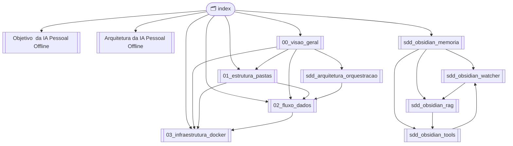

Source: Antigravity AI
Tags: #ia-pessoal #arquitetura #index
Related: [[00_visao_geral]] [[Arquitetura da IA Pessoal Offline]]

# K.A.O.S — Índice Central

> Hub de navegação do vault. Todos os nós do Graph View passam por aqui.

---

## 🎯 Ponto de Partida

- [[Objetivo  da IA Pessoal Offline|Objetivo do Projeto]]
- [[Arquitetura da IA Pessoal Offline|Visão da Arquitetura (alto nível)]]
- [[00_visao_geral|Visão Geral Técnica (Stack e Mapa)]]

---

## 📐 Documentação Arquitetural

| Nota | Conteúdo |
| :--- | :--- |
| [[00_visao_geral\|00 — Visão Geral]] | Stack tecnológica e mapa da documentação |
| [[01_estrutura_pastas\|01 — Estrutura de Pastas]] | Camadas do projeto (Spring Boot Style) |
| [[02_fluxo_dados\|02 — Fluxo de Dados]] | Ciclo de vida da requisição e grafo LangGraph |
| [[03_infraestrutura_docker\|03 — Infraestrutura Docker]] | Docker Compose, serviços e variáveis de ambiente |
| [[backlog\|Backlog]] | Planejamento e status das fases |

---

## 🧠 SDDs — System Design Documents

| Nota | Componente | Status |
| :--- | :--- | :--- |
| [[sdd_obsidian_memoria\|SDD — Sistema de Memória]] | Arquitetura geral da memória com Obsidian | ✅ |
| [[sdd_obsidian_watcher\|SDD — File Watcher & Indexer]] | Monitoramento do vault e pipeline de indexação | ✅ |
| [[sdd_obsidian_rag\|SDD — Vector Search & RAG]] | Embeddings, Qdrant e recuperação semântica | ✅ |
| [[sdd_obsidian_tools\|SDD — Schemas das Ferramentas]] | Tools do LangGraph para manipular notas | ✅ |
| [[sdd_roadmap\|SDD — Roadmap Inicial]] | 9 fases de evolução da plataforma | ✅ |
| [[sdd_arquitetura_orquestracao\|SDD — Proxy OpenAI & Gateway]] | Arquitetura do proxy /v1/chat/completions + Triple-Router | ✅ |
| [[sdd_user_context_propagation\|SDD — User Context & Multiusuário]] | Propagação de contexto de usuário e memória isolada | ✅ |
| [[estrategia_repositorios\|Estratégia de Repositórios]] | Monorepo → Multi-repo | 📝 |
| [[sdd_knowledge_wiki_layer\|SDD — Knowledge Wiki Layer]] | LLM Wiki + RAG Híbrido, wiki persistente, draft mode | 📝 Novo |
| [[sdd_llm_provider_hybrid\|SDD — Provedor Híbrido de LLM]] | Multi-provedor (Ollama, OpenAI, Claude, Gemini) | 📝 Novo |

---

## 🐍 SDDs de Implementação Python (Por Fase)

| Nota | Fase | Conteúdo | Status |
| :--- | :---: | :--- | :--- |
| [[sdd_fase1_fundacao\|SDD — Fase 1: Fundação]] | 1 ✅ | `pyproject.toml`, FastAPI, Settings, Logs, Docker Compose, Python 3.13 | ✅ |
| [[sdd_fase2_ia_local\|SDD — Fase 2: IA Local]] | 2 ✅ | LLMService, Ollama, Proxy OpenAI, Qwen3:4b, Open WebUI | ✅ |
| [[sdd_fase3_obsidian_service\|SDD — Fase 3: ObsidianService]] | 3 ✅ | CRUD de notas, 7 Tools LangGraph, Testes | ✅ |
| [[sdd_fase4_rag_pipeline\|SDD — Fases 4-5: RAG + Watcher]] | 4-5 ✅ | Embedder, Chunking, Indexer, Retriever, Watchdog, **Singleton Embedder, score_threshold, diagnósticos** | ✅ |
| [[sdd_fase5_watcher_langgraph\|SDD — Fases 6-7: LangGraph + Memória]] | 6-7 ✅ | AgentState, Grafo, Planner, Executor, Memória, **Fast Intent Classifier, MemoryRouter, observabilidade** | ✅ |
| [[sdd_fase8_performance_routing\|SDD — Fase 8: Performance + Roteamento Inteligente]] | 8 🟡 | Fast/MEMORY/SMART routing, warmup, cache, métricas | 🟡 Em progresso |
| [[sdd_fase9_integracoes\|SDD — Fase 9: Integrações]] | 9 ⬜ | N8N, GitHub, Email, AWS, Webhooks | ⬜ Planejado |

---

## 🔗 Mapa de Dependências entre Componentes

---

## 📋 Backlog & Planejamento

| Nota | Conteúdo |
| :--- | :--- |
| [[backlog\|Backlog Completo]] | Todas as tarefas organizadas por fase com mapa de dependências |

---

## ✅ TODOs e Próximos Passos

- [x] **Proxy OpenAI** — Endpoint `/v1/chat/completions` com streaming e system prompt
- [x] **System Prompt K.A.O.S.** — Injeção automática em toda requisição do Open WebUI
- [x] **CORS** — Configurado no FastAPI para aceitar requisições do container
- [x] **Timeout 600s** — LLMService ajustado para modelos CPU lentos
- [x] **app/agent/graph.py** — Grafo LangGraph com nós planner, executor, retrieve
- [x] **app/obsidian/tools/** — Ferramentas CRUD de notas (create, read, update, delete, search)
- [x] **app/rag/** — Pipeline RAG (embedder, chunking, indexer, retriever)
- [x] **File Watcher** — Monitoramento do vault com watchdog
- [x] **Conectar LangGraph ao endpoint de chat** — Rota completa com agente (`/api/chat/message` e `/v1/chat/completions`)
- [x] **Configurar modelos de embedding** — `BAAI/bge-m3`
- [ ] **SDD Knowledge Wiki Layer** — Criado, aguardando implementação
- [ ] **SDD LLM Provider Hybrid** — Criado, aguardando implementação

---

*Gerado automaticamente — navegue pelo Graph View (`Ctrl+G`) para visualizar as conexões.*
