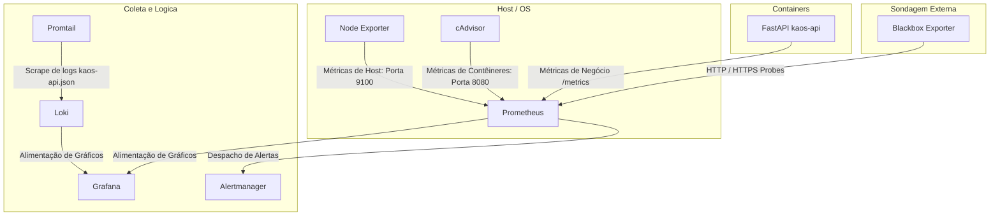

# SDD-OBS-001 — Arquitetura de Observabilidade (K.A.O.S)

## 1. Visão Geral

Este documento detalha o ecossistema de observabilidade e alertas ativos implementados em produção para telemetria fina de infraestrutura (host e contêineres), monitoramento de logs centralizados e probes de disponibilidade externa.

---

## 2. Componentes da Stack de Observabilidade

---

## 3. Configuração dos Componentes

### 3.1. Node Exporter (Métricas do Host)
Instanciado diretamente em modo host (`network_mode: host` e `pid: host`) para garantir acesso completo aos recursos de rede, threads, uso de memória física e estatísticas de disco do servidor Linux subjacente.

### 3.2. cAdvisor (Métricas de Contêineres)
Executado em modo privilegiado (`privileged: true`) para acessar e decodificar dados do cgroups e do Docker Engine diretamente do host, expondo dados estruturados de CPU, memória e conexões de rede por container.

### 3.3. Alertmanager (Gerenciamento de Alertas)
Responsável por agrupar e rotear notificações disparadas pelo Prometheus. Suporta o roteamento para Discord, WhatsApp, Telegram, Slack ou e-mail.
* **Configuração básica (`alertmanager.yml`):** Define receivers e rotas de alertas em [infra/docker/alertmanager.yml](file:///c:/workspace/Freelancer/K.A.O.S/infra/docker/alertmanager.yml).

### 3.4. Blackbox Exporter (Sondagem Externa)
Responsável por sondar externamente os serviços, verificando se eles estão acessíveis fora da rede Docker privada da Cloudflare. Monitora:
* **api.kaostech.com.br** (`/health`)
* **n8n.kaostech.com.br** (para validar autenticação e disponibilidade)
* **chat.kaostech.com.br** (Open WebUI)
* **whatsapp.kaostech.com.br** (Evolution API)
* **grafana.kaostech.com.br**
* **prometheus.kaostech.com.br**
* **loki.kaostech.com.br**
* **alertmanager.kaostech.com.br**

Isso permite detectar instantaneamente problemas de resolução de DNS da Cloudflare, expiração de certificados SSL/TLS, latência da rede e quedas na borda.

---

## 4. Regras de Alerta Ativas (alerts.yml)

As seguintes regras são avaliadas pelo Prometheus a cada 15 segundos:

1. **InstanceDown:** Disparado se algum serviço monitorado de observabilidade (ex: `kaos-api`, `qdrant`) ficar offline por mais de 1 minuto.
2. **DiskSpaceLow:** Disparado se o espaço em disco do host for inferior a 20%.
3. **InodeLimitReached:** Disparado se a quantidade de inodes livres no host for inferior a 10%.
4. **ContainerUnhealthy:** Disparado se um container Docker falhar no healthcheck configurado no Docker Compose.
5. **APIEndpointDown:** Disparado se o Blackbox Exporter reportar que os endpoints públicos falharam por mais de 1 minuto.
