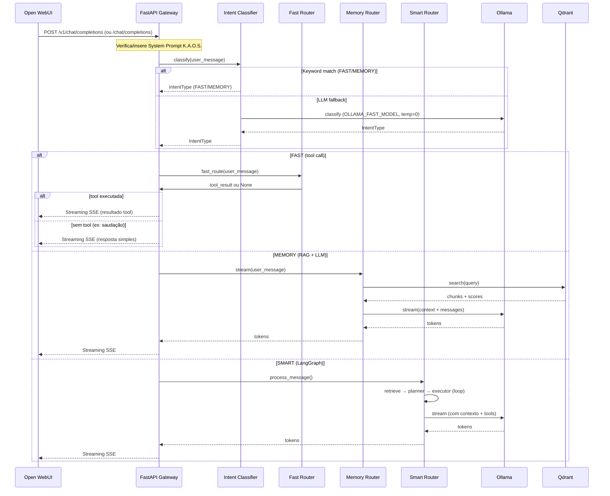

Source: Antigravity AI
Tags: #sdd #python #fastapi #proxy #openai #gateway
Related: [[index]] [[00_visao_geral]] [[02_fluxo_dados]] [[sdd_fase2_ia_local]]

# SDD — Proxy OpenAI & Gateway de Orquestração

## Objetivo

Documentar a arquitetura do proxy OpenAI-compatível que roteia requisições do Open WebUI através do FastAPI, injetando o system prompt do K.A.O.S. e garantindo que todo o tráfego passe pelo gateway antes de chegar ao Ollama.

---

## Visão Geral

O Open WebUI não se conecta diretamente ao Ollama. Em vez disso, é configurado no **modo OpenAI**, apontando para o FastAPI:

```
Open WebUI → FastAPI (Triple-Router) → FAST / MEMORY / SMART → Ollama / Tools
```

Isso garante:
- Injeção obrigatória do system prompt do K.A.O.S.
- CORS habilitado para requisições cross-origin do container
- Um ponto único de controle para logging, monitoramento e futuras transformações
- Compatibilidade total com o formato OpenAI (qualquer cliente OpenAI pode usar)
- **Roteamento inteligente**: FAST (ferramentas), MEMORY (RAG), SMART (LangGraph)

---

## Arquitetura

```mermaid
graph LR
    OWUI[Open WebUI] -->|OpenAI API| GW[FastAPI Gateway]
    GW -->|Triple-Router| FAST[FAST Router]
    GW -->|Triple-Router| MEMORY[Memory Router]
    GW -->|Triple-Router| SMART[Smart Router / LangGraph]
    FAST -->|Tools| TOOLS[Obsidian Tools]
    MEMORY -->|RAG| QDRANT[Qdrant Vector DB]
    MEMORY -->|Stream| OLLAMA[Ollama qwen3:4b]
    SMART -->|Agent| LANGGRAPH[LangGraph]
    LANGGRAPH -->|Tools| TOOLS
    LANGGRAPH -->|RAG| QDRANT
    LANGGRAPH -->|Stream| OLLAMA
    
    subgraph FastAPI["FastAPI (porta 8000)"]
        OAI[/v1/chat/completions]
        LEGACY[/chat/completions]
        MODELS[/v1/models]
        MODELS_LEG[/models]
        CHAT[/api/chat/message]
        INDEX[/indexing/full]
        RAG[/rag/context]
        HEALTH[/health]
    end
    
    OWUI --> OAI
    OWUI --> LEGACY
    OAI -->|Intent Classifier| GW
    GW -->|FAST| FAST
    GW -->|MEMORY| MEMORY
    GW -->|SMART| SMART
```

---

## Endpoints do Gateway

| Endpoint | Método | Router | Descrição | Streaming |
| :------- | :----- | :----- | :-------- | :-------: |
| `GET /` | GET | main | Root — informações do serviço | ❌ |
| `GET /health` | GET | health | Health check (liveness) | ❌ |
| `GET /health/readiness` | GET | health | Readiness check (inclui Ollama) | ❌ |
| `POST /api/chat/message` | POST | chat | Chat interno (LangGraph) | ✅ |
| `POST /v1/chat/completions` | POST | openai | Proxy OpenAI (usado pelo Open WebUI) | ✅ |
| `POST /chat/completions` | POST | legacy | **Legacy** Open WebUI compat | ✅ |
| `GET /v1/models` | GET | openai | Lista modelos (kaos, kaos-fast, kaos-rag) | ❌ |
| `GET /models` | GET | legacy | **Legacy** lista modelos | ❌ |
| `POST /indexing/full` | POST | indexing | Reindexação completa do vault | ❌ |
| `POST /indexing/init-folders` | POST | indexing | Cria estrutura de pastas do vault | ❌ |
| `POST /rag/context` | POST | rag | Busca contexto RAG (semântico) | ❌ |

### Modelos Disponíveis

| Model ID | Rota | Uso |
| :------- | :--- | :-- |
| `kaos` | DEFAULT | SMART (LangGraph completo) |
| `kaos-fast` | FAST | FAST (ferramentas diretas, sem LLM/RAG) |
| `kaos-rag` | MEMORY | MEMORY (RAG + Ollama, sem LangGraph) |

---

## Fluxo do Proxy OpenAI (Triple-Router)



---

## System Prompt do K.A.O.S.

Definido em `assistant/app/config/prompts.py`. Injetado automaticamente se o payload não contiver um `role: system`.

```python
KAOS_SYSTEM_PROMPT = """Você é K.A.O.S. (Knowledge Assistant & Offline System)..."""
```

---

## Configuração do Open WebUI

No `docker-compose.yml`, o Open WebUI é configurado para usar o FastAPI como backend OpenAI:

```yaml
environment:
  - OPENAI_API_BASE_URL=http://host.docker.internal:8000
  - OPENAI_API_KEY=kaos-local
  - DEFAULT_MODEL=qwen3:4b
```

- `host.docker.internal:8000` → Resolve o host da máquina de dentro do container
- `OPENAI_API_KEY` → Qualquer valor (o proxy não valida localmente)
- `DEFAULT_MODEL` → Modelo padrão exibido na UI

---

## Contexto de Usuário

A partir da Fase 8, o gateway propaga o `UserContext` (user_id, username, role) do Open WebUI para o AgentService. Consulte [[sdd_user_context_propagation]] para a arquitetura detalhada.

## Considerações de Segurança

- Atualmente sem autenticação (ambiente local)
- O CORS permite todas as origens (`allow_origins=["*"]`)
- Para produção, adicionar validação de API Key e restringir CORS

---

## Dependências

- [[sdd_fase2_ia_local]] — Implementação do LLMService e endpoint de chat

## Desbloqueia

- Integração com qualquer cliente compatível com OpenAI API
- Futura camada de autenticação e rate limiting
- Middleware de logging e tracing centralizado
