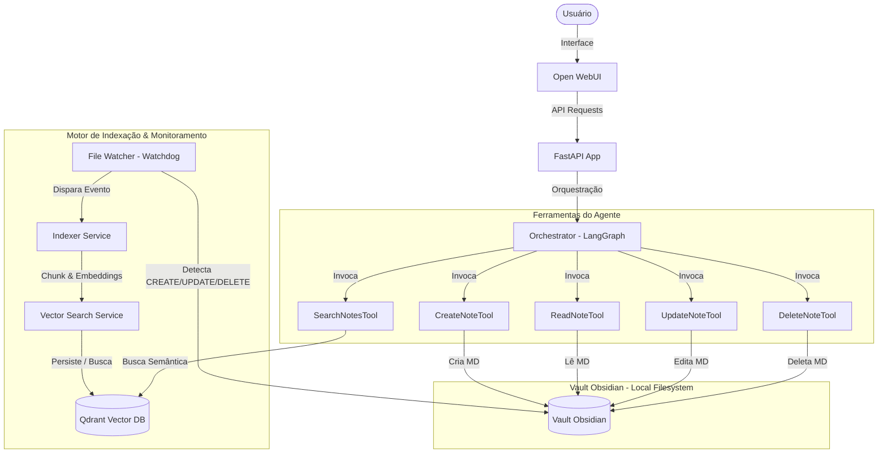
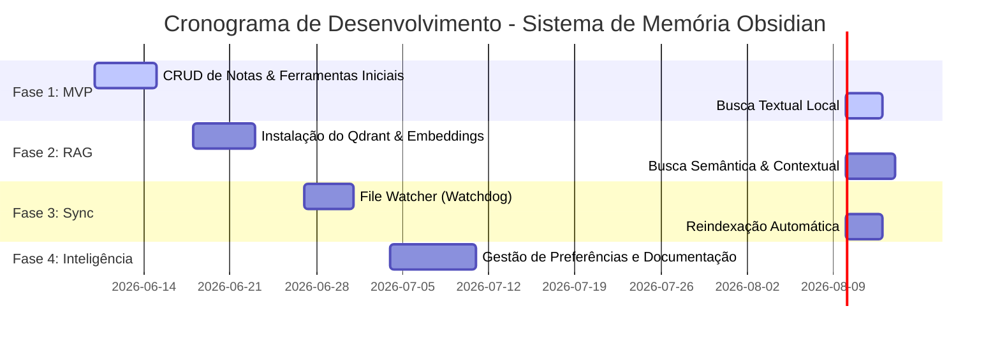

Source: Notas no ClickUp
Tags: #sdd #obsidian #memoria #rag #langgraph
Related: [[index]] [[sdd_obsidian_watcher]] [[sdd_obsidian_rag]] [[sdd_obsidian_tools]]

# SDD — Sistema de Memória Inteligente com Obsidian

Este Documento de Design de Software (SDD) detalha a arquitetura do **Sistema de Memória Inteligente** que integra o Assistente de IA local com um Vault do Obsidian. O objetivo principal é dar à IA uma memória de longo prazo persistente, semântica e editável diretamente por arquivos Markdown.

---

## 🎯 Caso de Uso (User Story)

> "Como usuário do Assistente de IA Pessoal, eu quero que a IA consiga criar, atualizar, pesquisar e organizar notas dentro do meu Vault Obsidian, para que todo conhecimento gerado durante conversas, estudos, projetos e documentações seja armazenado e reutilizado futuramente como memória de longo prazo."

---

## 🏗️ Arquitetura do Sistema

O sistema é dividido em uma camada de controle (FastAPI), uma camada agentiva (LangGraph), um barramento de monitoramento de eventos local (File Watcher) e uma camada de armazenamento/busca semântica (Qdrant + RAG).

---

> **Nota:** A partir da Fase 8 (User Context & Multiusuário), a memória é escopada por `user_id`. Preferências e conversas são armazenadas em `Vault/users/{user_id}/` em vez de `Vault/IA/`. Consulte [[sdd_user_context_propagation]] para detalhes.

---

## 📁 Estrutura de Pastas Esperada no Vault

A IA organizará e recuperará notas baseando-se nas seguintes categorias/diretórios raiz do Vault:

- `Vault/Projetos/`: Status, escopo e logs de projetos ativos.
- `Vault/Arquitetura/`: Padrões e decisões arquiteturais de sistemas.
- `Vault/SDD/`: System Design Documents como este.
- `Vault/Estudos/`: Resumos de aprendizado e materiais de estudo.
- `Vault/IA/`: Notas sobre prompts, agentes e modelos.
- `Vault/Java/`: Desenvolvimento no ecossistema Java e Spring.
- `Vault/Python/`: scripts, tutoriais e padrões de design Python.
- `Vault/AWS/`: Arquitetura em nuvem e comandos AWS.
- `Vault/CI-CD/`: Pipelines e automações de deploy.
- `Vault/Diário/`: Registro diário de pensamentos, atividades e resumos de reuniões.

---

## 🔗 Componentes Detalhados

Para um maior aprofundamento técnico de cada componente, acesse as notas dedicadas:

1. **[[sdd_obsidian_watcher|File Watcher & Indexer Service]]**: Monitoramento em tempo real do sistema de arquivos e pipeline de vetorização.
2. **[[sdd_obsidian_rag|Vector Search & RAG Service]]**: Geração de embeddings e busca híbrida no Qdrant.
3. **[[sdd_obsidian_tools|Schemas das Ferramentas (Tools)]]**: Definições dos payloads JSON de entrada e saída das ferramentas expostas ao LangGraph.

---

## 📝 Requisitos do Sistema

### Requisitos Funcionais
| ID | Descrição |
| :--- | :--- |
| **RF-001** | A IA deve criar notas Markdown no Vault. |
| **RF-002** | A IA deve atualizar notas existentes. |
| **RF-003** | A IA deve excluir notas. |
| **RF-004** | A IA deve consultar notas armazenadas de forma textual. |
| **RF-005** | A IA deve executar busca semântica em todo o Vault. |
| **RF-006** | A IA deve indexar automaticamente novos arquivos adicionados ao Vault. |
| **RF-007** | A IA deve reindexar arquivos modificados e remover índices de arquivos excluídos. |
| **RF-008** | A IA deve utilizar as notas como memória contextual para enriquecer prompts. |
| **RF-009** | A IA deve sugerir a categoria/pasta correta ao salvar uma nota. |
| **RF-010** | A IA deve resumir conversas antes de salvá-las no Diário, quando solicitado. |

### Requisitos Não Funcionais
| ID | Descrição |
| :--- | :--- |
| **RNF-001** | Compatível com Python 3.13. |
| **RNF-002** | Suportar Vaults de grande porte (mais de 100.000 documentos). |
| **RNF-003** | Tempo máximo de indexação inferior a 5 segundos por documento modificado. |
| **RNF-004** | Persistência local (Qdrant + Postgres em Docker) sem dependência de internet. |
| **RNF-005** | Arquitetura compatível com Docker Compose. |
| **RNF-006** | Suportar múltiplos modelos de embedding (BGE-M3, Nomic-Embed). |

---

## 🗺️ Roadmap de Implementação

