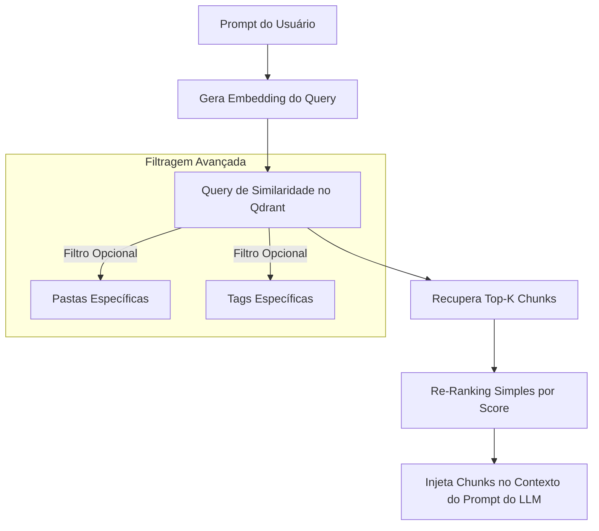

Source: Notas no ClickUp
Tags: #sdd #rag #qdrant #embeddings #vector-search
Related: [[sdd_obsidian_memoria]] [[sdd_obsidian_watcher]] [[sdd_obsidian_tools]]

# SDD Componente — Vector Search & RAG Service

Esta nota descreve o motor de busca semântica, as escolhas de modelos de embedding e a estratégia de Recuperação Aumentada de Geração (RAG) usada para fornecer contexto atualizado ao Assistente de IA.

---

## 🗄️ Estrutura do Vector Database (Qdrant)

O Qdrant armazena os chunks gerados a partir do Vault Obsidian em uma coleção unificada denominada `obsidian_memory`.

### Configuração da Coleção

- **Métrica de Distância**: Cosseno (`Cosine`).
- **Dimensão do Vetor**: 1024 dimensões (típico para `bge-m3`) ou 768 dimensões (típico para `nomic-embed-text`).
- **Indexação por Payload**: Criação de índices no payload para otimizar pesquisas baseadas em caminhos de arquivos e tags do Obsidian.

### Esquema do Payload no Qdrant
Cada ponto (vector point) no Qdrant possui um ID único gerado a partir do hash do caminho do arquivo + índice do chunk, facilitando deleções em massa.

```json
{
  "id": "e604f8db-56a8-4229-87a3-e298dfce48f9",
  "vector": [0.012, -0.045, 0.823, "..."],
  "payload": {
    "path": "Python/Padroes_Design.md",
    "chunk_index": 2,
    "content": "Padrão de projeto Singleton garante que uma classe tenha apenas uma instância...",
    "tags": ["python", "design-patterns"],
    "folder": "Python",
    "last_modified": "2026-06-10T13:10:00Z"
  }
}
```

---

## 🧠 Modelos de Embedding e RAG Pipeline

O sistema é flexível para suportar múltiplos modelos de embedding locais via Hugging Face/Sentence Transformers ou através do próprio Ollama.

### Modelos Suportados

1. **`BAAI/bge-m3` (Recomendado)**:
   - **Vantagens**: Excelente suporte a múltiplos idiomas (incluindo Português), lida muito bem com textos técnicos e de código, e suporta comprimentos de contexto longos (até 8192 tokens).
   - **Dimensão**: 1024.
2. **`nomic-ai/nomic-embed-text`**:
   - **Vantagens**: Extremamente rápido de rodar localmente e muito leve.
   - **Dimensão**: 768.

---

## 🔍 Algoritmo de Recuperação e Ranking (Retrieval Workflow)

Quando o usuário envia um prompt, a IA utiliza a ferramenta `SearchNotesTool` para resgatar dados do Obsidian.



### Mecanismo de Busca Híbrida e Filtro por Payload
Para otimizar os resultados, as queries feitas no Qdrant podem incluir cláusulas de filtro (`filters`). Por exemplo, se a IA souber que a dúvida do usuário é sobre Python, ela pode filtrar apenas documentos onde `"folder": "Python"`.

```python
# Exemplo de consulta filtrada no Qdrant Client
from qdrant_client import QdrantClient
from qdrant_client.models import Filter, FieldCondition, MatchValue

client = QdrantClient("http://localhost:6333")

results = client.search(
    collection_name="obsidian_memory",
    query_vector=query_embedding,
    query_filter=Filter(
        must=[
            FieldCondition(key="folder", match=MatchValue(value="Python"))
        ]
    ),
    limit=5
)
```

---

## 🔗 Relação com outras Notas
- O ciclo em que esses vetores são inseridos por eventos de escrita é visto em [[sdd_obsidian_watcher]].
- Para ver o mapeamento exato da ferramenta que a IA usa para consultar esse serviço, consulte [[sdd_obsidian_tools]].
