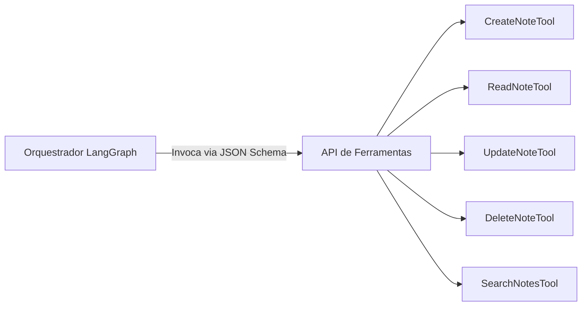

Source: Notas no ClickUp
Tags: #sdd #langgraph #tools #json-schema #fastapi
Related: [[sdd_obsidian_memoria]] [[sdd_obsidian_rag]] [[sdd_obsidian_watcher]] [[02_fluxo_dados]]

# SDD Componente — Schemas das Ferramentas (Tools)

Esta nota descreve as especificações técnicas das ferramentas (Tools) expostas pelo FastAPI para o motor de agentes do LangGraph. Elas são a ponte que permite à IA manipular arquivos markdown e realizar buscas semânticas.

---

## 🛠️ Catálogo de Ferramentas



---

### 1. CreateNoteTool
Permite à IA criar notas estruturadas em diretórios apropriados dentro do Vault.

- **Parâmetros de Entrada (JSON)**:
  ```json
  {
    "title": "Configuração do Docker Compose",
    "folder": "CI-CD",
    "content": "# Docker Compose Config\nDetalhes sobre containerization..."
  }
  ```
- **Retorno de Sucesso (JSON)**:
  ```json
  {
    "status": "CREATED",
    "path": "CI-CD/Configuração do Docker Compose.md",
    "absolute_path": "/workspace/Vault/CI-CD/Configuração do Docker Compose.md"
  }
  ```

---

### 2. ReadNoteTool
Permite ler o conteúdo bruto de uma nota específica.

- **Parâmetros de Entrada (JSON)**:
  ```json
  {
    "path": "CI-CD/Configuração do Docker Compose.md"
  }
  ```
- **Retorno de Sucesso (JSON)**:
  ```json
  {
    "path": "CI-CD/Configuração do Docker Compose.md",
    "content": "# Docker Compose Config\nDetalhes sobre containerization...",
    "last_modified": "2026-06-10T13:14:00Z"
  }
  ```

---

### 3. UpdateNoteTool
Permite atualizar o conteúdo de uma nota existente de maneira integral ou via substituição estruturada.

- **Parâmetros de Entrada (JSON)**:
  ```json
  {
    "path": "CI-CD/Configuração do Docker Compose.md",
    "content": "# Docker Compose Config\nDetalhes sobre containerization...\n## Atualização: Adicionado serviço do Qdrant."
  }
  ```
- **Retorno de Sucesso (JSON)**:
  ```json
  {
    "status": "UPDATED",
    "path": "CI-CD/Configuração do Docker Compose.md"
  }
  ```

---

### 4. DeleteNoteTool
Remove uma nota fisicamente do Vault. O File Watcher detectará a remoção e excluirá os vetores correspondentes no Qdrant.

- **Parâmetros de Entrada (JSON)**:
  ```json
  {
    "path": "CI-CD/Configuração do Docker Compose.md"
  }
  ```
- **Retorno de Sucesso (JSON)**:
  ```json
  {
    "status": "DELETED",
    "path": "CI-CD/Configuração do Docker Compose.md"
  }
  ```

---

### 5. SearchNotesTool
Executa buscas de similaridade no Qdrant (semântica) e/ou busca simples por palavras-chave no sistema de arquivos do Vault.

- **Parâmetros de Entrada (JSON)**:
  ```json
  {
    "query": "Como configurar o Qdrant localmente no docker compose",
    "folder_filter": "CI-CD",
    "limit": 3
  }
  ```
- **Retorno de Sucesso (JSON)**:
  ```json
  {
    "query": "Como configurar o Qdrant localmente no docker compose",
    "documents": [
      {
        "path": "CI-CD/Configuração do Docker Compose.md",
        "score": 0.892,
        "content": "Para rodar o Qdrant no docker, usamos a imagem oficial qdrant/qdrant..."
      }
    ]
  }
  ```

---

## 🛑 Tratamento de Erros Comuns

Caso ocorra um problema durante a execução de alguma das ferramentas, o retorno seguirá um padrão previsível para que o agente do LangGraph possa raciocinar sobre o erro e corrigi-lo:

```json
{
  "status": "ERROR",
  "error_type": "FileNotFound",
  "message": "A nota 'Projetos/Inexistente.md' não pôde ser encontrada no Vault.",
  "recovery_suggestion": "Verifique o caminho exato usando SearchNotesTool primeiro."
}
```

---

## 🔗 Relação com outras Notas
- A forma como estas ferramentas interagem diretamente com o sistema de arquivos do Obsidian é descrita em [[sdd_obsidian_watcher]].
- A lógica de busca semântica chamada pela ferramenta de busca está em [[sdd_obsidian_rag]].
