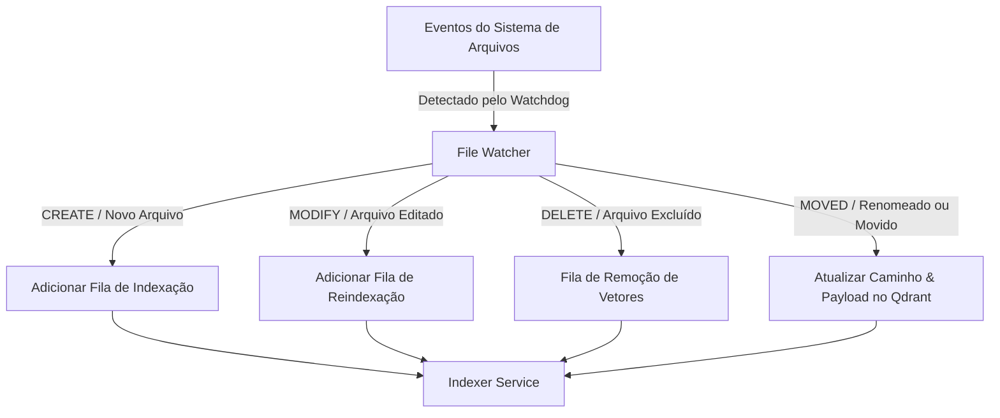

Source: Notas no ClickUp
Tags: #sdd #obsidian #watcher #indexer #watchdog
Related: [[sdd_obsidian_memoria]] [[sdd_obsidian_rag]] [[sdd_obsidian_tools]]

# SDD Componente — File Watcher & Indexer Service

Este documento detalha o funcionamento interno do **File Watcher** (Monitor de Arquivos) e do **Indexer Service** (Serviço de Indexação). Juntos, eles garantem que o banco de dados de vetores (Qdrant) esteja sempre em sincronia com o estado físico das notas Markdown no Vault Obsidian.

---

## 👁️ File Watcher (Monitor de Arquivos)

O File Watcher é um serviço em segundo plano executado via biblioteca `watchdog` (Python). Ele monitora recursivamente o diretório raiz do Vault Obsidian definido no `.env` (`OBSIDIAN_VAULT_PATH`).

### Fluxo de Eventos

O monitor escuta eventos nativos do sistema operacional e mapeia-os para ações específicas do Indexer:



### Detalhes de Implementação do Watchdog
```python
# Exemplo conceitual do Watcher Handler
from watchdog.events import FileSystemEventHandler

class ObsidianVaultHandler(FileSystemEventHandler):
    def __init__(self, indexer_service):
        self.indexer = indexer_service

    def on_created(self, event):
        if not event.is_directory and event.src_path.endswith('.md'):
            self.indexer.queue_indexing(event.src_path)

    def on_modified(self, event):
        if not event.is_directory and event.src_path.endswith('.md'):
            self.indexer.queue_reindexing(event.src_path)

    def on_deleted(self, event):
        if not event.is_directory and event.src_path.endswith('.md'):
            self.indexer.queue_deletion(event.src_path)

    def on_moved(self, event):
        if not event.is_directory and event.dest_path.endswith('.md'):
            self.indexer.queue_move(event.src_path, event.dest_path)
```

---

## ⚙️ Indexer Service (Serviço de Indexação)

O **Indexer Service** é responsável por ler os arquivos markdown, processá-los estruturalmente, extrair metadados (como tags e frontmatter YAML) e quebrar o texto em pedaços lógicos (chunks).

### Processo de Indexação (Passo a Passo)

1. **Leitura e Parsing**:
   - Lê o arquivo `.md` do disco de forma assíncrona.
   - Extrai o cabeçalho YAML Frontmatter (ex: tags, data de criação, título alternativo).
   - Ignora metadados específicos do Obsidian que não agregam valor ao contexto da IA.

2. **Chunking Semântico**:
   - Utiliza um `RecursiveCharacterTextSplitter` configurado para respeitar quebras de linha (`\n\n`), cabeçalhos markdown (`#`, `##`, `###`) e parágrafos.
   - **Tamanho do Chunk**: Proposta de 500 a 1000 caracteres.
   - **Sobreposição (Overlap)**: 100 a 200 caracteres para preservar a continuidade de conceitos entre chunks.

3. **Geração de Embeddings**:
   - O chunk é enviado ao `Vector Search Service` para gerar um vetor de alta dimensão (ex: dimensão 1024 para o modelo `bge-m3`).

4. **Upsert no Qdrant**:
   - O vetor gerado é enviado para o Qdrant. O payload gravado inclui:
     ```json
     {
       "path": "Projetos/Arquitetura IA.md",
       "chunk_index": 0,
       "text": "Conteúdo do chunk...",
       "tags": ["ia", "arquitetura", "sdd"],
       "updated_at": "2026-06-10T13:14:00Z"
     }
     ```

---

## 🛡️ Robustez e Tratamento de Concorrência

Para atender ao **RNF-002** (suportar mais de 100.000 documentos) e **RNF-003** (tempo de indexação < 5s):

- **Fila com Debounce**: Evitar disparar múltiplas indexações quando o usuário salva o arquivo continuamente (debounce de 1 a 2 segundos antes de executar a indexação física).
- **Processamento Assíncrono (`asyncio`)**: A leitura do disco e as chamadas de API do Qdrant ocorrem sem bloquear a thread principal da API FastAPI.
- **Transações no Qdrant**: Utilização do campo `path` como chave de identificação única no payload, garantindo a remoção em massa de todos os vetores antigos pertencentes a uma nota antes de inserir os novos chunks atualizados (evitando duplicação de informações).
