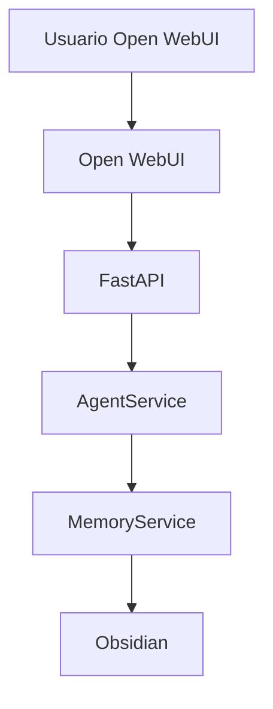
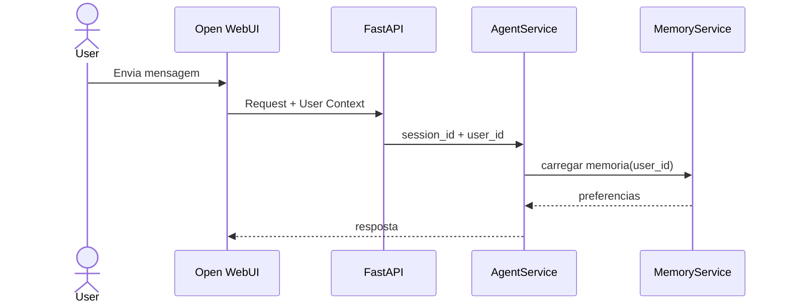

Source: K.A.O.S Project
Tags: #sdd #user-context #multiusuario #memoria
Related: [[index]] [[02_fluxo_dados]] [[sdd_obsidian_memoria]] [[sdd_arquitetura_orquestracao]] [[backlog]]

# SDD — User Context Propagation & Multiusuário

> Tipo: System Design Document
> Status: **Implementado** ✅
> Prioridade: Alta
> Relacionado: [[02_fluxo_dados]] [[sdd_obsidian_memoria]] [[sdd_arquitetura_orquestracao]] [[backlog]]

---

## Objetivo

Permitir que o K.A.O.S identifique qual usuário do Open WebUI iniciou uma conversa, possibilitando:

- Memória isolada por usuário
- Histórico individual
- Preferências separadas
- Projetos independentes
- Auditoria de ações
- Evolução futura para PostgreSQL

---

## Problema Resolvido ✅

O problema original era que o Open WebUI autentica usuários, porém o K.A.O.S não recebia nem utilizava essas informações.

**Fluxo Anterior (Resolvido):**
```
Open WebUI
    ↓
FastAPI
    ↓
AgentService
```

O AgentService criava `session_id = stream_id` (ex: `chatcmpl-a123`), sem identificação de usuário.

**Fluxo Atual (Implementado):**
```
Open WebUI
    ↓ (headers: x-user-id, x-username, x-user-role)
FastAPI /v1/chat/completions
    ↓ (UserContext in request)
Intent Classifier → Router (FAST/MEMORY/SMART)
    ↓ (user_id propagated)
AgentService / MemoryRouter / FastRouter
    ↓ (user_id in AgentState / MemoryService)
MemoryService (Vault/users/{user_id}/)
```

**Implementação:**
- Headers Open WebUI: `x-user-id`, `x-username`, `x-user-role` lidos no endpoint `/v1/chat/completions`
- `UserContext` propagado via `ChatCompletionRequest` → `AgentState` / `MemoryRouter`
- `MemoryService` escopo por usuário: `Vault/users/{user_id}/{preferencias,projetos,memoria}.md`
- Logs estruturados com `user_id` para auditoria
- Compatível com migração futura para PostgreSQL (MemoryRepository protocol)

---

## Objetivos Funcionais

### OF01 — Identificação do Usuário

O sistema deve identificar o usuário autenticado no Open WebUI.

### OF02 — Memória Isolada

Cada usuário deve possuir memória independente.

Exemplo:

```
users/
├── brian/
│   ├── preferencias.md
│   ├── projetos.md
│   └── memoria.md
└── jaem/
    ├── preferencias.md
    ├── projetos.md
    └── memoria.md
```

### OF03 — Histórico Individual

Conversas devem ser associadas ao usuário correto.

### OF04 — Compatibilidade

A solução deve funcionar mesmo antes da adoção do PostgreSQL.

---

## Arquitetura Proposta



---

## Fluxo de Dados



---

## Modelo de Contexto

```python
class UserContext(BaseModel):
    user_id: str
    username: str
    role: str
```

---

## Alterações no AgentState

Atual:

```python
class AgentState(TypedDict):
    messages: list
    retrieved_context: list
    tool_to_call: str | None
    tool_args: dict
    tool_result: dict | None
    session_id: str
```

Novo:

```python
class AgentState(TypedDict):
    messages: list
    retrieved_context: list
    tool_to_call: str | None
    tool_args: dict
    tool_result: dict | None
    session_id: str
    user_id: str
    username: str
    role: str
```

---

## Estrutura de Memória

### Opção Inicial (Obsidian)

```
Vault/
users/
├── brian/
│   ├── preferencias.md
│   ├── projetos.md
│   └── memoria.md
└── jaem/
    ├── preferencias.md
    ├── projetos.md
    └── memoria.md
```

### Estrutura Futura (PostgreSQL)

```sql
users
------
id
username
email
role

chat_sessions
-------------
id
user_id

chat_messages
-------------
id
session_id
role
content

preferences
-----------
id
user_id
key
value
```

---

## MemoryService

Novo comportamento:

```python
memory.get_preferences(user_id)
```

Em vez de:

```python
memory.get_preferences()
```

---

## SaveConversation Tool

Atual:

```python
save_conversation(summary, user_message, assistant_response)
```

Novo:

```python
save_conversation(user_id, summary, user_message, assistant_response)
```

---

## Auditoria

Toda ação deve registrar:

```
timestamp
user_id
session_id
tool
resultado
```

---

## Compatibilidade com PostgreSQL

A implementação deve seguir o padrão Repository:

```python
class MemoryRepository(Protocol):
    ...
```

Implementações:

```python
ObsidianMemoryRepository
PostgresMemoryRepository
```

Permitindo migração futura sem alterar o AgentService.

---

## Critérios de Aceite ✅ Todos Atendidos

- [x] O usuário autenticado no Open WebUI é identificado pelo FastAPI (headers `x-user-id`, `x-username`, `x-user-role`).
- [x] O AgentState contém user_id, username, role.
- [x] O MemoryService utiliza user_id (escopo `Vault/users/{user_id}/`).
- [x] Preferências são isoladas por usuário.
- [x] Conversas são salvas separadamente por usuário.
- [x] Compatível com futura migração para PostgreSQL (MemoryRepository protocol).
- [x] Logs registram usuário responsável pela ação (`[user=...]`).
- [x] Endpoints legados (`/chat/completions`) também propagam contexto.

---

## Benefícios

- Memória individual por usuário
- Maior rastreabilidade
- Base para PostgreSQL
- Base para RBAC futuro
- Compatível com Open WebUI
- Preparação para ambiente multiusuário

---

## Próxima Evolução

Após esta implementação:

1. PostgreSQL para memória estruturada
2. User Repository
3. RBAC avançado
4. Compartilhamento de conhecimento entre usuários
5. Times e Workspaces
6. Integração com Open WebUI Groups
7. Permissões por ferramenta LangGraph
8. Auditoria completa de execução do agente
