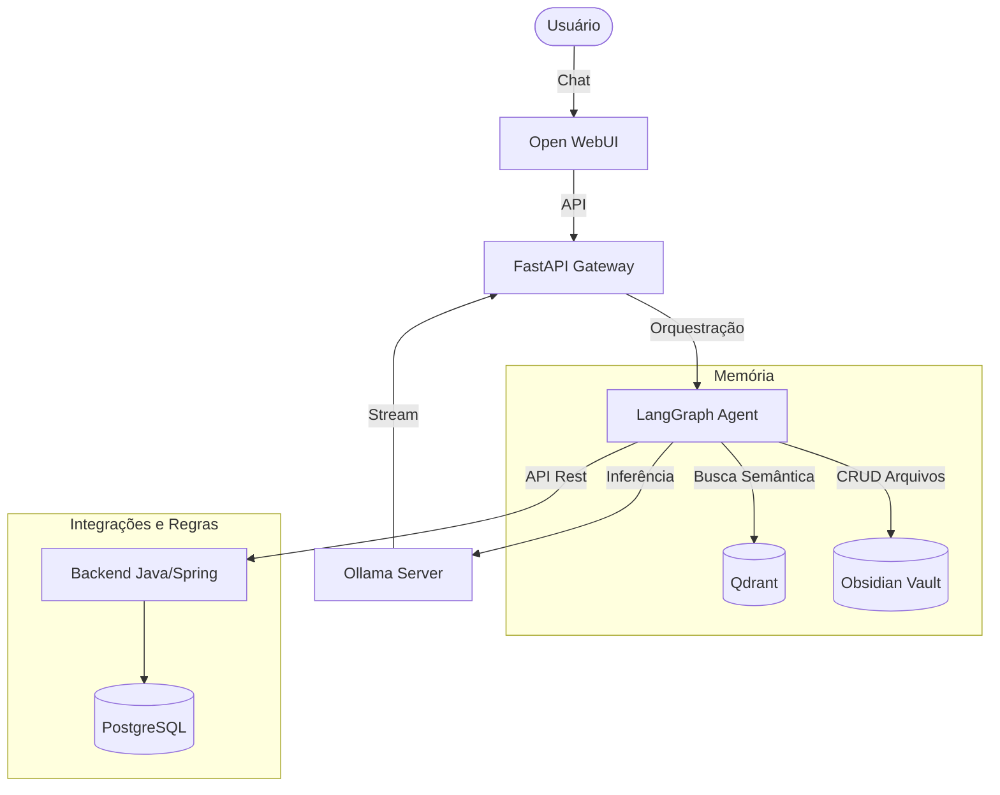

Source: Antigravity AI
Tags: #sdd #arquitetura #kaos #langgraph #orquestracao #agente
Related: [[index]] [[backlog]] [[sdd_fase5_watcher_langgraph]] [[02_fluxo_dados]]

# SDD — Arquitetura de Orquestração da KAOS

## Nome do Projeto

KAOS — Knowledge Automation & Orchestration System

---

## Objetivo

Definir a arquitetura oficial de processamento de mensagens da KAOS.
Este documento deve ser considerado a fonte de verdade para qualquer implementação futura da plataforma.

---

## Problema

Por padrão, o Open WebUI se conecta diretamente ao Ollama.

**Fluxo padrão:**
```text
Usuário → Open WebUI → Ollama → Resposta
```

**Limitações:**
* Não utiliza memória do Obsidian
* Não utiliza Qdrant
* Não utiliza agentes
* Não utiliza ferramentas
* Não executa automações
* Não acessa regras de negócio

Neste cenário a IA funciona apenas como um chatbot local.

---

## Solução

A KAOS utilizará uma camada de orquestração entre o Open WebUI e o modelo LLM.

**Fluxo oficial:**
```text
Usuário → Open WebUI → FastAPI Gateway → LangGraph Agent → Tools → Ollama → Resposta
```

---

## Arquitetura Oficial



---

## Papel dos Componentes

### Open WebUI
**Responsabilidade:**
* Interface do usuário
* Histórico de conversas
* Upload de arquivos
* Gerenciamento de sessões

**Não deve:** Executar lógica de negócio, RAG ou automações.

### FastAPI
**Responsabilidade:**
* Porta de entrada oficial da KAOS
* Receber mensagens do Open WebUI
* Encaminhar para o agente

### LangGraph
**Responsabilidade:**
* Orquestração e planejamento
* Escolha de ferramentas
* Execução de fluxos
* É o **cérebro operacional** da KAOS.

### Ollama
**Responsabilidade:**
* Inferência dos modelos e geração de respostas
* Não possui memória própria.

### Obsidian
**Responsabilidade:**
* Memória permanente, Conhecimento, Documentação, Preferências, Projetos e SDDs.

### Qdrant
**Responsabilidade:**
* Busca semântica, Recuperação de contexto e Vetorização.

### Backend
**Responsabilidade:**
* Regras de negócio, APIs e Persistência relacional.
* **Tecnologia:** Java 21, Spring Boot.

### N8N
**Responsabilidade:**
* Integrações externas, automações e workflows.
* Deve ser considerado **opcional**.

---

## Regra Fundamental

> A KAOS deve continuar funcionando mesmo se o N8N estiver indisponível.

---

## Ferramentas Oficiais

### Obsidian
* **ReadNoteTool**: Ler notas.
* **CreateNoteTool**: Criar notas.
* **UpdateNoteTool**: Atualizar notas.
* **DeleteNoteTool**: Excluir notas.
* **SearchNotesTool**: Buscar notas.

### Memória
* **QdrantSearchTool**: Recuperar contexto semântico.

### Backend
* **UserTool**: Gerenciar usuários.
* **ProjectTool**: Gerenciar projetos.

### Integrações
* **N8NTool**: Executar workflows externos.

---

## Estratégias

### Estratégia de Recuperação de Contexto
Quando uma pergunta depender de conhecimento armazenado:
```text
Pergunta → QdrantSearchTool → Contexto Recuperado → Prompt Enriquecido → Ollama → Resposta
```

### Estratégia de Escrita de Memória
Quando uma ação modificar conhecimento:
```text
CreateNoteTool → Obsidian → Indexer → Qdrant
```
*A memória deve permanecer sincronizada.*

---

## O que NÃO é a Arquitetura Oficial

### ❌ Não utilizar fluxo direto Open WebUI → Ollama
**Motivo**: Ignora toda a camada de memória.

### ❌ Não utilizar fluxo Open WebUI → Pipeline RAG → Ollama
**Motivo**: Funciona apenas para recuperação de contexto. Não suporta agentes, ferramentas, automações e backend. A Pipeline RAG deve existir apenas como uma **ferramenta interna** acessada pelo LangGraph.

---

## Critério de Sucesso

A KAOS deve ser capaz de:
* Responder utilizando contexto do Obsidian.
* Criar e atualizar notas.
* Recuperar conhecimento semântico.
* Executar ferramentas autonomamente.
* Funcionar offline e sem internet.
* Operar de forma independente do N8N.
* Escalar para integrações futuras sem alterar a arquitetura principal.
