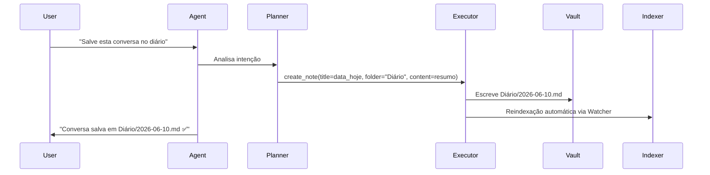
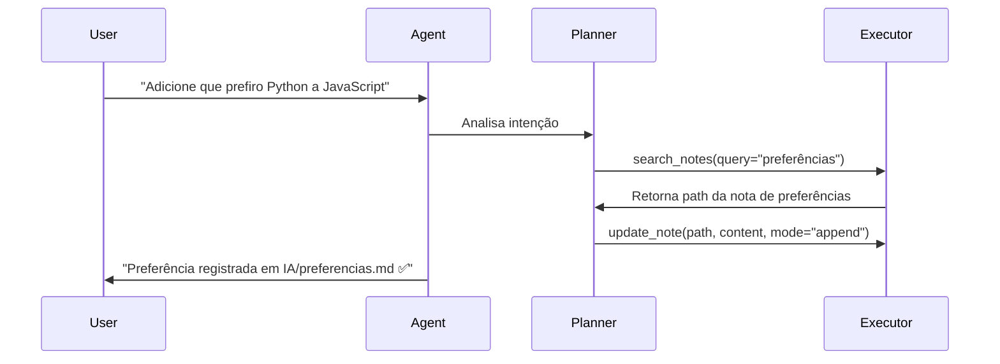

Source: Antigravity AI
Tags: #sdd #python #langgraph #agente #memoria #fase6 #fase7
Related: [[index]] [[backlog]] [[sdd_fase4_rag_pipeline]] [[sdd_fase3_obsidian_service]] [[02_fluxo_dados]] [[sdd_obsidian_tools]]

# SDD — Fases 6 e 7: LangGraph Agent + Memória de Longo Prazo

## Objetivo

Implementar o orquestrador central de inteligência da plataforma usando LangGraph. O agente receberá os inputs do usuário, recuperará contexto do Vault via RAG, decidirá quais ferramentas executar e gerará respostas coerentes. Na Fase 7, o sistema ganha comandos semânticos para persistir e recuperar memória de longo prazo.

---

## Critério de Sucesso (Fase 6)

> O usuário solicita "crie uma nota sobre o que conversamos" e o agente decide autonomamente usar a ferramenta `CreateNoteTool` e salva o resumo em `Diário/`.

## Critério de Sucesso (Fase 7)

> Em uma nova sessão, o usuário pergunta "o que eu estava estudando na semana passada?" e o agente recupera e cita o conteúdo de `Diário/` e `Estudos/` sem intervenção manual.

---

## Tarefas — Fase 6 (Agente LangGraph)

- [ ] Instalar LangGraph (`uv add langgraph`)
- [ ] Criar `AgentState` (`app/agent/state.py`)
- [ ] Criar grafo principal (`app/agent/graph.py`)
- [ ] Criar Tool Registry com ferramentas do Obsidian
- [ ] Implementar nó `planner`
- [ ] Implementar nó `executor`

## Tarefas — Fase 7 (Memória de Longo Prazo)

- [ ] Criar memória de preferências
- [ ] Criar memória de projetos
- [ ] Implementar comando "salve esta conversa"
- [ ] Implementar comando "atualize esta nota"

---

## 1. Estrutura de Módulos

```text
app/
├── agent/
│   ├── __init__.py
│   ├── state.py            # TypedDict do estado do grafo
│   ├── graph.py            # Builder do grafo LangGraph
│   └── nodes/
│       ├── retrieve.py     # Nó: busca RAG no Qdrant
│       ├── planner.py      # Nó: LLM decide próxima ação
│       ├── executor.py     # Nó: executa ferramenta escolhida
│       └── generator.py    # Nó: gera resposta final
└── service/
    └── agent_service.py    # Serviço que instancia e invoca o grafo
```

---

## 2. Estado do Agente (`agent/state.py`)

O `AgentState` é o "contrato" de dados que circula entre todos os nós do grafo.

```python
from typing import TypedDict, Annotated
from langchain_core.messages import BaseMessage
import operator

class AgentState(TypedDict):
    # Mensagens da conversa (acumuladas via operador de append)
    messages: Annotated[list[BaseMessage], operator.add]
    # Contexto recuperado do Qdrant (RAG)
    retrieved_context: list[dict]
    # Nome da ferramenta decidida pelo planner (None = responder diretamente)
    tool_to_call: str | None
    # Argumentos da ferramenta
    tool_args: dict
    # Resultado da execução da ferramenta
    tool_result: dict | None
    # ID da sessão de chat (para persistência)
    session_id: str
```

---

## 3. Nó de Recuperação RAG (`agent/nodes/retrieve.py`)

```python
from langchain_core.messages import HumanMessage
from app.agent.state import AgentState
from app.rag.retriever.semantic_retriever import SemanticRetriever

_retriever = SemanticRetriever()

def retrieve_context(state: AgentState) -> dict:
    """Busca chunks relevantes no Qdrant com base na última mensagem do usuário."""
    last_message = next(
        (m for m in reversed(state["messages"]) if isinstance(m, HumanMessage)),
        None,
    )
    if not last_message:
        return {"retrieved_context": []}

    results = _retriever.search(query=last_message.content, limit=5)
    context = [{"path": r.path, "content": r.excerpt, "score": r.score} for r in results]
    return {"retrieved_context": context}
```

---

## 4. Nó Planner (`agent/nodes/planner.py`)

O Planner é o LLM que analisa o contexto e decide entre chamar uma ferramenta ou responder diretamente. Usa `tool_calls` nativo do LangChain para structured output.

```python
from langchain_ollama import ChatOllama
from langchain_core.messages import SystemMessage
from app.agent.state import AgentState
from app.config.settings import settings

# System Prompt com instruções de uso de ferramentas
SYSTEM_PROMPT = """Você é um assistente pessoal inteligente com acesso ao Vault Obsidian do usuário.

Ferramentas disponíveis:
- create_note(title, folder, content): Cria uma nova nota no Vault
- read_note(path): Lê o conteúdo de uma nota
- update_note(path, content, mode): Atualiza uma nota (overwrite ou append)
- delete_note(path): Remove uma nota
- search_notes(query): Busca notas por palavra-chave

Use as ferramentas quando o usuário solicitar explicitamente ações de memória.
Prefira responder diretamente quando tiver contexto suficiente."""

_llm = ChatOllama(model=settings.OLLAMA_MODEL, base_url=settings.OLLAMA_BASE_URL)

def planner(state: AgentState) -> dict:
    """LLM decide a próxima ação: chamar ferramenta ou gerar resposta."""
    context_text = "\n\n".join(
        f"[{c['path']}]\n{c['content']}" for c in state.get("retrieved_context", [])
    )
    system_with_context = SYSTEM_PROMPT
    if context_text:
        system_with_context += f"\n\nContexto recuperado do Vault:\n{context_text}"

    messages = [SystemMessage(content=system_with_context)] + state["messages"]
    response = _llm.invoke(messages)

    # Verifica se houve tool_call (modelo decidiu usar ferramenta)
    if hasattr(response, "tool_calls") and response.tool_calls:
        tool_call = response.tool_calls[0]
        return {
            "tool_to_call": tool_call["name"],
            "tool_args": tool_call["args"],
            "messages": [response],
        }

    return {"tool_to_call": None, "messages": [response]}
```

---

## 5. Nó Executor (`agent/nodes/executor.py`)

```python
from loguru import logger
from app.agent.state import AgentState
from app.obsidian.tools.create_note_tool import create_note
from app.obsidian.tools.read_note_tool import read_note
from app.obsidian.tools.update_note_tool import update_note
from app.obsidian.tools.delete_note_tool import delete_note
from app.obsidian.tools.search_notes_tool import search_notes

TOOL_REGISTRY: dict = {
    "create_note": create_note,
    "read_note": read_note,
    "update_note": update_note,
    "delete_note": delete_note,
    "search_notes": search_notes,
}

def executor(state: AgentState) -> dict:
    """Executa a ferramenta escolhida pelo planner e grava o resultado no estado."""
    tool_name = state.get("tool_to_call")
    tool_args = state.get("tool_args", {})

    if not tool_name or tool_name not in TOOL_REGISTRY:
        return {"tool_result": {"error": f"Ferramenta '{tool_name}' não encontrada."}}

    logger.info(f"Executando ferramenta: {tool_name} com args: {tool_args}")
    tool_fn = TOOL_REGISTRY[tool_name]
    result = tool_fn.invoke(tool_args)
    return {"tool_result": result, "tool_to_call": None}
```

---

## 6. Grafo LangGraph (`agent/graph.py`)

```python
from langgraph.graph import StateGraph, END
from app.agent.state import AgentState
from app.agent.nodes.retrieve import retrieve_context
from app.agent.nodes.planner import planner
from app.agent.nodes.executor import executor

def should_use_tool(state: AgentState) -> str:
    """Aresta condicional: executa ferramenta ou termina."""
    if state.get("tool_to_call"):
        return "executor"
    return END

def build_graph() -> StateGraph:
    graph = StateGraph(AgentState)

    graph.add_node("retrieve", retrieve_context)
    graph.add_node("planner", planner)
    graph.add_node("executor", executor)

    graph.set_entry_point("retrieve")
    graph.add_edge("retrieve", "planner")
    graph.add_conditional_edges("planner", should_use_tool)
    graph.add_edge("executor", "planner")  # Loop: após executar, replanejar

    return graph.compile()

agent_graph = build_graph()
```

---

## 7. Agent Service (`service/agent_service.py`)

```python
from langchain_core.messages import HumanMessage
from app.agent.graph import agent_graph
from app.agent.state import AgentState
from loguru import logger

class AgentService:
    """Serviço que gerencia o ciclo de vida das sessões do agente."""

    async def process_message(self, session_id: str, user_message: str) -> str:
        """Processa uma mensagem do usuário e retorna a resposta final do agente."""
        logger.info(f"[{session_id}] Processando: {user_message[:60]}...")

        initial_state: AgentState = {
            "messages": [HumanMessage(content=user_message)],
            "retrieved_context": [],
            "tool_to_call": None,
            "tool_args": {},
            "tool_result": None,
            "session_id": session_id,
        }

        final_state = await agent_graph.ainvoke(initial_state)

        # Extrai a última mensagem do assistente
        last_ai_message = next(
            (m for m in reversed(final_state["messages"]) if m.type == "ai"),
            None,
        )
        return last_ai_message.content if last_ai_message else "Sem resposta."
```

---

## 8. Comandos de Memória de Longo Prazo (Fase 7)

Estes são fluxos de uso que o agente executa por intenção semântica do usuário.

### "Salve esta conversa"


### "Atualize a nota de preferências"


---

## Dependências Desta Fase

- [[sdd_fase3_obsidian_service]] — Tools do Obsidian registradas no Tool Registry
- [[sdd_fase4_rag_pipeline]] — SemanticRetriever usado no nó de recuperação

## Desbloqueia

- Fase 8 (Integrações Online) — O agente já tem capacidade de invocar webhooks via tools adicionais (N8N, GitHub)
