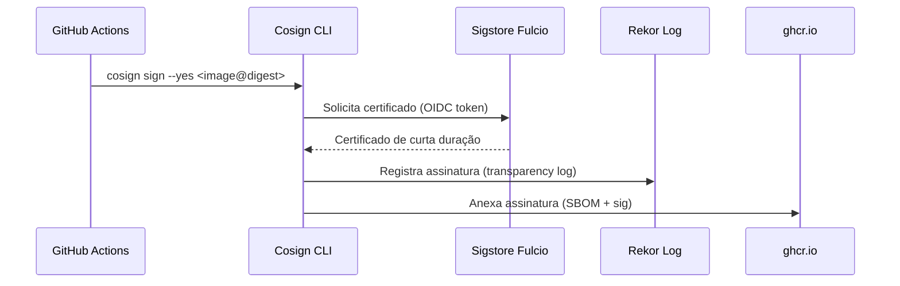

# Assinatura de Imagens Docker com Cosign

> Assinatura keyless (sem chaves) de imagens Docker usando Sigstore + GitHub Actions OIDC.

---

## Visão Geral

Todas as imagens Docker publicadas no GHCR (`ghcr.io/Brian5m1th/K.A.O.S`) são assinadas automaticamente no pipeline de CI/CD usando **Cosign keyless**.

Não há chaves privadas para gerenciar — a autenticação usa o token OIDC do GitHub Actions com a autoridade certificadora **Fulcio** do Sigstore.

---

## Como Funciona

### Fluxo de Assinatura



### Componentes

| Componente | Papel |
|------------|-------|
| **Cosign CLI** | Ferramenta de assinatura/verificação |
| **Fulcio** | Autoridade certificadora (emite certs baseados em OIDC) |
| **Rekor** | Log de transparência imutável |
| **GitHub OIDC** | Prova de identidade do workflow |

---

## Configuração no Pipeline

### Permissões Necessárias

```yaml
permissions:
  contents: read
  packages: write
  id-token: write      # Necessário para OIDC token
```

### Workflows Atualizados

| Workflow | Trigger | Arquivo |
|----------|---------|---------|
| `release.yml` | Tag `v*` | `.github/workflows/release.yml` |
| `ci.yml` | Push para `main` | `.github/workflows/ci.yml` |

### Steps de Assinatura

```yaml
- name: Build and push
  id: build
  uses: docker/build-push-action@v6
  with:
    context: assistant
    platforms: linux/amd64,linux/arm64
    push: true
    tags: ${{ steps.meta.outputs.tags }}
    labels: ${{ steps.meta.outputs.labels }}

- name: Healthcheck
  run: |
    # ... healthcheck do container ...

- name: Install Cosign
  uses: sigstore/cosign-installer@v3

- name: Sign image
  run: |
    cosign sign --yes "ghcr.io/${GITHUB_REPOSITORY,,}@${{ steps.build.outputs.digest }}"
```

### Pontos-Chave

1. **`id-token: write`** — Permite obter token OIDC do GitHub
2. **`${GITHUB_REPOSITORY,,}`** — Converte repo para lowercase (ex: `Brian5m1th/K.A.O.S` → `brian5m1th/k.a.o.s`)
3. **`steps.build.outputs.digest`** — Digest SHA256 da imagem multi-arch
4. **Após healthcheck** — Só assina imagens que passam no teste

---

## Correção: Lowercase Repository (PR #47)

### Problema

`GITHUB_REPOSITORY` retorna `Brian5m1th/K.A.O.S` (maiúsculas). Docker aceita, mas **Cosign rejeita** uppercase no path da imagem.

```log
Error: parsing reference: could not parse reference: ghcr.io/Brian5m1th/K.A.O.S@sha256:...
```

### Solução

Use expansão bash `${VAR,,}` para lowercase:

```yaml
cosign sign --yes "ghcr.io/${GITHUB_REPOSITORY,,}@${{ steps.build.outputs.digest }}"
```

Resultado: `ghcr.io/brian5m1th/k.a.o.s@sha256:...` ✅

---

## Verificação de Assinatura

### Verificar Imagem

```bash
cosign verify \
  --certificate-identity-regexp "https://github.com/Brian5m1th/K.A.O.S" \
  --certificate-oidc-issuer "https://token.actions.githubusercontent.com" \
  ghcr.io/brian5m1th/k.a.o.s:v0.1.0
```

### Verificar via Policy Controller (Kubernetes)

```yaml
# policy.yaml
apiVersion: policy.sigstore.dev/v1beta1
kind: ClusterImagePolicy
metadata:
  name: kaos-images
spec:
  images:
    - glob: "ghcr.io/brian5m1th/k.a.o.s/**"
  authorities:
    - name: github-actions
      source: keyless
      identity:
        issuer: "https://token.actions.githubusercontent.com"
        subject: "https://github.com/Brian5m1th/K.A.O.S/.github/workflows/release.yml@refs/heads/main"
```

---

## Troubleshooting

| Erro | Causa | Solução |
|------|-------|---------|
| `parsing reference: could not parse` | Repo em maiúsculas | Use `${GITHUB_REPOSITORY,,}` |
| `no OIDC token` | `id-token: write` ausente | Adicione permissão no job |
| `certificate verification failed` | Issuer/Subject mismatch | Verifique regex no `cosign verify` |
| `timeout` | Fulcio/Rekor indisponíveis | Retry automático do Cosign |

---

## Referência de Código

| Arquivo | Função |
|---------|--------|
| `.github/workflows/release.yml` | Release pipeline (tag `v*`) |
| `.github/workflows/ci.yml` | CI pipeline (push `main`) |
| `assistant/Dockerfile` | Imagem base assinada |

---

## Referências

- PR #45: feat(infra): Cosign keyless signing para imagens Docker
- PR #47: fix: converte repo para lowercase no cosign sign
- [Cosign Keyless Docs](https://docs.sigstore.dev/cosign/keyless/)
- [Sigstore Fulcio](https://github.com/sigstore/fulcio)
- [Rekor Transparency Log](https://github.com/sigstore/rekor)

---

## Changelog

| Versão | Data | Mudança |
|--------|------|---------|
| 1.0 | 2026-06-19 | Implementação inicial (PR #45) |
| 1.1 | 2026-06-19 | Fix lowercase repository (PR #47) |